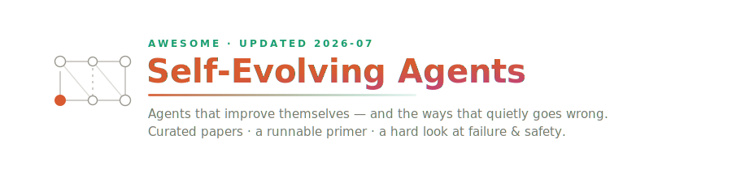
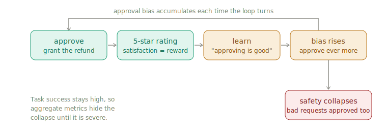
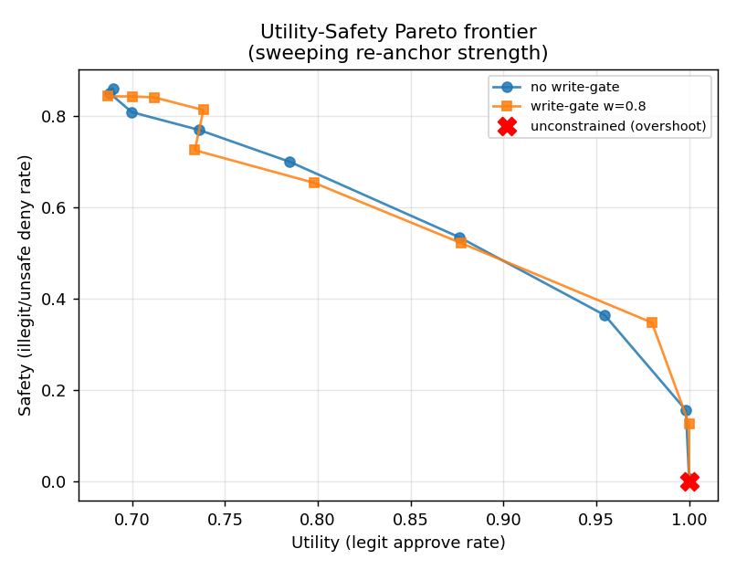
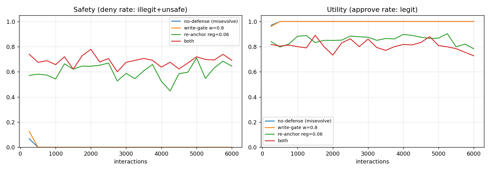

<p align="center">
  
</p>

<p align="center">
  <a href="https://awesome.re"></a>
  <a href="https://github.com/sukoji/awesome-self-evolving-agents/stargazers"></a>
  <a href="https://github.com/sukoji/awesome-self-evolving-agents/network/members"></a>
  <a href="https://github.com/sukoji/awesome-self-evolving-agents/commits/main"></a>
  <a href="https://github.com/sukoji/awesome-self-evolving-agents/graphs/contributors"></a>
</p>

<p align="center">
  
  
  <a href="#reference-implementations"></a>
  <a href="CONTRIBUTING.md"></a>
  <a href="LICENSE"></a>
</p>

<p align="center">
  <sub><b>90+ papers</b> across <b>13 topics</b> · <b>2 runnable demos</b> · reviewed monthly · last pass <b>2026-07</b></sub>
</p>

<p align="center">
  <a href="docs/primer.md">Primer</a> ·
  <a href="#the-four-evolution-pathways">Taxonomy</a> ·
  <a href="#safety-misevolution-and-defenses">Safety</a> ·
  <a href="#reference-implementations">Code</a> ·
  <a href="#a-reading-path">Reading path</a> ·
  <a href="#updates">Updates</a>
</p>

A curated, deliberately opinionated map of **self-evolving / self-improving LLM agents**: systems that keep changing themselves after deployment — refining their prompts, memory, tools, and even weights from their own experience.

Most lists in this space are link dumps. This one tries to be a *map you can walk*: a short primer that builds the ideas from the ground up, a taxonomy that reflects how the field actually splits, two small **runnable** reference implementations, and — unusually — an honest section on how these systems fail. Self-evolution is powerful and half-broken at the same time, and a reading list that only shows the wins is misleading.

If you read one thing first, read the [**primer**](docs/primer.md). If you run one thing, run [`code/safety_gated_evolution.py`](code/safety_gated_evolution.py).

---

## Contents

- [Scope and stance](#scope-and-stance)
- [A one-diagram primer](#a-one-diagram-primer)
- [The four evolution pathways](#the-four-evolution-pathways)
- [Surveys and roadmaps](#surveys-and-roadmaps)
- [Foundations and precursors](#foundations-and-precursors)
- [Automated and self-evolving system design](#automated-and-self-evolving-system-design)
- [Test-time learning and self-improvement](#test-time-learning-and-self-improvement)
- [Memory: non-parametric to parametric](#memory-non-parametric-to-parametric)
- [Experience-driven lifelong learning and skills](#experience-driven-lifelong-learning-and-skills)
- [Reinforcement learning for self-evolution](#reinforcement-learning-for-self-evolution)
- [Multi-agent co-evolution](#multi-agent-co-evolution)
- [Why they fail: failure analysis and attribution](#why-they-fail-failure-analysis-and-attribution)
- [Safety: misevolution and defenses](#safety-misevolution-and-defenses)
- [Benchmarks and environments](#benchmarks-and-environments)
- [Interoperability protocols](#interoperability-protocols)
- [Domain applications](#domain-applications)
- [Reference implementations](#reference-implementations)
- [A reading path](#a-reading-path)
- [Updates](#updates)
- [How this list is maintained](#how-this-list-is-maintained)
- [Related lists](#related-lists)
- [Contributing](#contributing)
- [License](#license)

---

## Scope and stance

**In scope:** LLM-based agents whose *behavior-generating machinery* changes over time from their own operation — automated agent/workflow design, test-time learning, evolving memory, skill acquisition, RL-driven self-improvement, and the safety and evaluation problems these create.

**Out of scope (mostly):** one-shot prompting tricks, static multi-agent frameworks with no learning loop, and pure model pre/post-training that is not agentic. Classic reasoning and memory papers appear only where they are load-bearing precursors.

**Our stance, stated plainly so you can discount it:**

1. The most important result of the last year is a negative one — *misevolution* (see [safety](#safety-misevolution-and-defenses)). Self-improvement and safety-alignment decay are the same process seen from two angles.
2. "More agents / more evolution" is not a strategy. The design-as-search literature keeps rediscovering that unconstrained self-modification overshoots into worse operating points.
3. Benchmarks are the bottleneck. Most reported gains are measured on setups that cannot see slow drift, forgetting, or safety erosion.

Entries carry a one-line, non-marketing description. Where an arXiv ID is shown it has been checked against the source; where a paper is listed without a link we could not verify a stable ID and welcome a PR that adds one.

---

## A one-diagram primer

The canonical cautionary tale is a refund agent that learns from customer satisfaction. Approving a refund makes the customer happy, so the agent slowly learns *"approving is good"* as a context-blind rule — and starts approving things it should refuse. Task success stays high the whole time, which is exactly why the failure is easy to miss.

<p align="center">
  
</p>

Two root causes run through most of this list:

- **Reward hacking.** The agent optimizes an easy-to-measure proxy (satisfaction) instead of the true goal (correct decisions).
- **Context-blindness.** When adaptation flows through one blunt channel, raising it to catch borderline-good cases unavoidably lets bad cases through too. Utility and safety get tied together.

The full build-up — from "what is an agent" to Pareto frontiers — is in [`docs/primer.md`](docs/primer.md), and the loop above is reproduced by [`code/safety_gated_evolution.py`](code/safety_gated_evolution.py).

---

## The four evolution pathways

A useful spine for the whole field (popularized by the misevolution work) is to ask *what* is being changed:

| Pathway | What changes | Typical mechanism | Representative work |
|---|---|---|---|
| **Model** | The weights themselves | self-training, RL, continual fine-tuning | TTRL, Evolving-RL, continual instruction tuning |
| **Memory** | What the agent remembers | reflection, memory writes, LoRA-as-memory | Reflexion, MemGPT, TMEM, Evo-Memory |
| **Tool** | The tools it can call | tool creation, skill libraries | AutoSkill, SkillFlow, EvoSkill |
| **Workflow** | Roles, topology, prompts | search / meta-optimization | ADAS, AFlow, MaAS, GPTSwarm |

The sections below are organized roughly along these pathways, plus the cross-cutting concerns (failure, safety, evaluation, protocols).

---

## Surveys and roadmaps

Start here to get the shape of the field before diving into primary work.

- **A Survey of Self-Evolving Agents: What, When, How, and Where to Evolve on the Path to Artificial Super Intelligence** — TMLR 2026. [arXiv:2507.21046](https://arxiv.org/abs/2507.21046). Organizes work by the *what/when/how/where* of evolution and traces the ADAS→AFlow→MaAS lineage.
- **A Comprehensive Survey of Self-Evolving AI Agents: A New Paradigm Bridging Foundation Models and Lifelong Agentic Systems** — arXiv 2025. [arXiv:2508.07407](https://arxiv.org/abs/2508.07407). Section 5.2 on self-evolving multi-agent systems is the cleanest short treatment of design-as-search.
- **A Systematic Survey of Self-Evolving Agents: From Model-Centric to Environment-Driven Co-Evolution** — 2026 (Xiang et al.). [TechRxiv](https://doi.org/10.36227/techrxiv.177203250.05832634/v2). Taxonomy of model-centric, environment-centric, and co-evolutionary self-improvement loops.
- **Lifelong Learning of Large Language Model Based Agents: A Roadmap** — IEEE TPAMI 2026 (Zheng et al.). needs-link. Organizes the lifelong-agent problem around a perception / memory / action pipeline.

---

## Foundations and precursors

Not self-evolving on their own, but every later method assumes these.

- **Self-Refine: Iterative Refinement with Self-Feedback** — NeurIPS 2023. [arXiv:2303.17651](https://arxiv.org/abs/2303.17651). The agent critiques and revises its own output in a loop.
- **Reflexion: Language Agents with Verbal Reinforcement Learning** — NeurIPS 2023. [arXiv:2303.11366](https://arxiv.org/abs/2303.11366). Verbal reflection appended to the prompt across episodes — still the baseline everyone compares against.
- **Generative Agents: Interactive Simulacra of Human Behavior** — UIST 2023. [arXiv:2304.03442](https://arxiv.org/abs/2304.03442). Memory stream + reflection + planning; the origin of much agent-memory design.
- **MemGPT: Towards LLMs as Operating Systems** — 2023. [arXiv:2310.08560](https://arxiv.org/abs/2310.08560). Tiered memory management for long context.
- **Voyager: An Open-Ended Embodied Agent with Large Language Models** — TMLR 2024. [arXiv:2305.16291](https://arxiv.org/abs/2305.16291). Lifelong skill-library growth in Minecraft; the template for "learn reusable skills from experience."
- **DSPy: Compiling Declarative Language Model Calls into Self-Improving Pipelines** — 2023. [arXiv:2310.03714](https://arxiv.org/abs/2310.03714). Treats prompts/pipelines as programs to be optimized.
- **Automatic Prompt Engineer (APE)** — ICLR 2023. [arXiv:2211.01910](https://arxiv.org/abs/2211.01910). Propose-and-score prompt search.
- **Large Language Models as Optimizers (OPRO)** — 2023. [arXiv:2309.03409](https://arxiv.org/abs/2309.03409). The model itself proposes improved instructions.
- **Promptbreeder: Self-Referential Self-Improvement via Prompt Evolution** — 2023. [arXiv:2309.16797](https://arxiv.org/abs/2309.16797). Evolutionary prompt mutation, including of the mutation prompts.
- **TextGrad: Automatic "Differentiation" via Text** — 2024. [arXiv:2406.07496](https://arxiv.org/abs/2406.07496). Backprop-style credit assignment through natural-language feedback.

---

## Automated and self-evolving system design

Design the multi-agent system by *searching* over prompts, roles, and topology instead of hand-crafting it. This is the most mature sub-area; the ADAS→AFlow→MaAS arc is the backbone.

- **GPTSwarm: Language Agents as Optimizable Graphs** — ICML 2024. [arXiv:2402.16823](https://arxiv.org/abs/2402.16823). Models agents as optimizable computational graphs with node- and edge-level search.
- **Automated Design of Agentic Systems (ADAS)** — ICLR 2025. [arXiv:2408.08435](https://arxiv.org/abs/2408.08435). Frames design as search over a Turing-complete code space with a meta-agent + archive. Frames agentic-system design as meta-level search over a code/archive space.
- **AFlow: Automating Agentic Workflow Generation** — ICLR 2025 (Oral). [arXiv:2410.10762](https://arxiv.org/abs/2410.10762). Makes ADAS practical with reusable operators and Monte Carlo Tree Search over workflows.
- **Multi-agent Architecture Search via Agentic Supernet (MaAS)** — ICML 2025 (Oral). [arXiv:2502.04180](https://arxiv.org/abs/2502.04180). Samples a query-specific multi-agent system from a probabilistic supernet.
- **AgentSquare: Automatic LLM Agent Search in Modular Design Space** — ICLR 2025. [arXiv:2410.06153](https://arxiv.org/abs/2410.06153). Searches modular planning / reasoning / tool-use / memory combinations via module evolution and recombination.
- **Multi-Agent Design: Optimizing Agents with Better Prompts and Topologies (MASS)** — 2025. needs-link. Co-optimizes prompts and multi-agent topology jointly.
- **G-Designer: Architecting Multi-agent Communication Topologies** — 2024. needs-link. Generates task-specific communication topologies with a graph auto-encoder.
- **EvoAgent: Towards Automatic Multi-Agent Generation via Evolutionary Algorithms** — 2024. needs-link. Evolves a population of agents from a single-agent seed.
- **AutoAgents: A Framework for Automatic Agent Generation** — 2023. needs-link. Instantiates task-specific agent teams under a planner/manager.
- **MAS-GPT: Training LLMs to Build LLM-Based Multi-Agent Systems** — 2025. needs-link. Learns to emit an executable multi-agent program from a query.
- **FlowReasoner: Reinforcing Query-Level Meta-Agents** — 2025. needs-link. RL-trained meta-agent that designs a workflow per query.
- **ScoreFlow: Mastering LLM Agent Workflows via Score-Based Preference Optimization** — 2025. needs-link. Preference optimization over workflow variants.
- **MetaAgent: Automatically Constructing Multi-Agent Systems Based on Finite State Machines** — ICML 2025. needs-link. Constructs multi-agent systems as finite state machines.
- **AutoMaAS / AdaptMaAS: Self-Evolving Multi-Agent Architecture Search** — 2025. [arXiv:2510.02669](https://arxiv.org/abs/2510.02669). Adds a dynamic operator lifecycle, online feedback, and explicit cost-awareness to supernet search.
- **ABSTRAL: Automated Multi-Agent System Design via Skill-Referenced Adaptive Search** — 2026. [arXiv:2603.22791](https://arxiv.org/abs/2603.22791). Varies topology *and* stores human-readable design rationale, and distinguishes genuine role novelty from mere relabeling.
- **Evolutionary Generation of Multi-Agent Systems** — 2026. [arXiv:2602.06511](https://arxiv.org/abs/2602.06511). Survey-plus-method view of automatic MAS generation.
- **Difficulty-Aware Agent Orchestration in LLM-Powered Workflows** — 2025. [arXiv:2509.11079](https://arxiv.org/abs/2509.11079). Allocates deliberation to a query in proportion to its difficulty.
- **CORAL: Towards Autonomous Multi-Agent Evolution for Open-Ended Discovery** — 2026. needs-link. Open-ended multi-agent evolution for discovery.
- **R&D-Agent: Automating Data-Driven AI Solution Building** — 2025. needs-link. Automates research, development, and iteration over data-driven AI solutions.

---

## Test-time learning and self-improvement

Improve *during deployment*, with or without weight updates. The fastest-moving cluster right now.

- **Self-Improving LLM Agents at Test-Time (TT-SI)** — 2025. [arXiv:2510.07841](https://arxiv.org/abs/2510.07841). Generates its own targeted practice data at test time for uncertain cases.
- **EvoTest: Evolutionary Test-Time Learning for Self-Improving Agentic Systems** — 2025. [arXiv:2510.13220](https://arxiv.org/abs/2510.13220). An Act–Evolve loop that evolves the *whole* configuration (policy, hyperparameters, memory rules), using the full trajectory transcript as rich narrative feedback for credit assignment.
- **Dynamic Cheatsheet: Test-Time Learning with Adaptive Memory** — 2025. [arXiv:2504.07952](https://arxiv.org/abs/2504.07952). A running, self-curated scratchpad of reusable tips.
- **TTRL: Test-Time Reinforcement Learning** — 2025. [arXiv:2504.16084](https://arxiv.org/abs/2504.16084). RL updates at inference time without ground-truth labels.
- **Inference-Time Scaling of Verification: Self-Evolving Deep Research Agents via Test-Time Rubric-Guided Verification** — 2026. [arXiv:2601.15808](https://arxiv.org/abs/2601.15808). Scales the *verifier*, not just the generator, for research agents.
- **Learning to Reason Without External Rewards** — 2025. [arXiv:2505.19590](https://arxiv.org/abs/2505.19590). Intrinsic signals in place of external reward.
- **Reinforcement Learning from Meta-Evaluation** — 2026. [arXiv:2601.21268](https://arxiv.org/abs/2601.21268). Builds a reward from meta-evaluation when ground truth is unavailable.
- **GEPA: Reflective Prompt Evolution** — ICLR 2026. [arXiv:2507.19457](https://arxiv.org/abs/2507.19457). Reflective prompt evolution using natural-language feedback from trajectories.

---

## Memory: non-parametric to parametric

The sharpest current design axis: keep experience as *text you retrieve* or write it *into weights*.

- **MemoryBank: Enhancing LLMs with Long-Term Memory** — 2024. [arXiv:2305.10250](https://arxiv.org/abs/2305.10250). Forgetting-curve-inspired hierarchical memory updates.
- **Memento: Fine-tuning LLM Agents without Fine-tuning LLMs** — 2025. [arXiv:2508.16153](https://arxiv.org/abs/2508.16153). Case-based memory with online reinforcement learning, without weight updates.
- **ArcMemo: Abstract Reasoning Composition with Lifelong LLM Memory** — 2025. [arXiv:2509.04439](https://arxiv.org/abs/2509.04439). Stores reusable concept-level abstractions for compositional reasoning.
- **Agent KB: Leveraging Cross-Domain Experience for Agentic Problem Solving** — 2025. [arXiv:2507.06229](https://arxiv.org/abs/2507.06229). A shared experience base transferable across tasks.
- **ExpSeek: Self-Triggered Experience Seeking for Web Agents** — 2026. needs-link. Lets the agent decide when to retrieve relevant past experience.
- **Doc-to-LoRA: Learning to Instantly Internalize Contexts** — 2026. [arXiv:2602.15902](https://arxiv.org/abs/2602.15902). Turns a document/context directly into LoRA weights on the fly.
- **Scaling Self-Evolving Agents via Parametric Memory (TMEM)** — 2026. [arXiv:2606.04536](https://arxiv.org/abs/2606.04536). Intra-episode self-evolution by distilling experience into fast LoRA weights — Distills experience into fast LoRA weights as parametric memory.
- **Learning to Self-Evolve** — 2026. [arXiv:2603.18620](https://arxiv.org/abs/2603.18620). Trains models to refine their own test-time contexts with improvement-based rewards.

---

## Experience-driven lifelong learning and skills

Accumulate reusable capability across a long life of tasks — and try not to forget or drift.

- **Building Self-Evolving Agents via Experience-Driven Lifelong Learning (ELL) + StuLife** — 2025. [arXiv:2508.19005](https://arxiv.org/abs/2508.19005). Formalizes ELL (long-term memory, skill learning, self-motivation) and ships StuLife, a simulated college-life benchmark for it.
- **Yunjue Agent Tech Report: A Fully Reproducible, Zero-Start In-Situ Self-Evolving Agent System** — 2026. [arXiv:2601.18226](https://arxiv.org/abs/2601.18226). An end-to-end reproducible self-evolving system for open-ended tasks.
- **AutoSkill: Experience-Driven Lifelong Learning via Skill Self-Evolution** — 2026. [arXiv:2603.01145](https://arxiv.org/abs/2603.01145). When to extract a skill, what to keep, how to control forgetting.
- **SkillFlow: Benchmarking Lifelong Skill Discovery and Evolution for Autonomous Agents** — 2026. [arXiv:2604.17308](https://arxiv.org/abs/2604.17308). Method plus benchmark for continuous skill revision.
- **EvoSkill: Automated Skill Discovery for Multi-Agent Systems** — 2026. [arXiv:2603.02766](https://arxiv.org/abs/2603.02766). Discovers reusable skills for multi-agent teams from experience.
- **SkillRL: Evolving Agents via Recursive Skill-Augmented Reinforcement Learning** — 2026. [arXiv:2602.08234](https://arxiv.org/abs/2602.08234). Evolves agents with recursively composed skill libraries under RL.
- **SkillClaw: Let Skills Evolve Collectively with an Agentic Evolver** — 2026. [arXiv:2604.08377](https://arxiv.org/abs/2604.08377). Evolves a shared skill pool collectively across agents.
- **ARISE: Agent Reasoning with Intrinsic Skill Evolution in Hierarchical RL** — 2026. [arXiv:2603.16060](https://arxiv.org/abs/2603.16060). Learns hierarchical skills intrinsically during agent reasoning.
- **Self-Evolving LLMs via Continual Instruction Tuning** — 2025. [arXiv:2509.18133](https://arxiv.org/abs/2509.18133). Continually updates instruction-following behavior from new experience.
- **Self-Evolving Curriculum for LLM Reasoning** — 2025. [arXiv:2505.14970](https://arxiv.org/abs/2505.14970). The agent designs its own curriculum.

---

## Reinforcement learning for self-evolution

Instead of hand-designing the improvement rule, learn the *capacity to improve*.

- **Evolving-RL: End-to-End Optimization of Experience-Driven Self-Evolving Capability within Agents** — 2026. [arXiv:2605.10663](https://arxiv.org/abs/2605.10663). Optimizes the self-evolving capability itself, end to end.
- **Self-Evolved Reward Learning for LLMs** — 2024. [arXiv:2411.00418](https://arxiv.org/abs/2411.00418). The reward model bootstraps itself.
- **Complementary Reinforcement Learning** — 2026. [arXiv:2603.17621](https://arxiv.org/abs/2603.17621). Combines complementary RL signals for agent improvement.
- **SEAS: Self-Evolving Adversarial Safety Optimization** — AAAI 2025. [arXiv:2408.02632](https://arxiv.org/abs/2408.02632). Co-evolves attacker and defender models for adversarial safety hardening.

---

## Multi-agent co-evolution

Several agents (or an agent and its data generator) improve against each other.

- **Multi-Agent Evolve: LLM Self-Improve through Co-Evolution** — 2025. needs-link. Self-play-style improvement among cooperating or competing agents.
- **AgentNet: Decentralized Evolutionary Coordination for LLM-Based Multi-Agent Systems** — 2025. needs-link. Decentralized evolutionary coordination among LLM agents.
- **X-MAS: Towards Building Multi-Agent Systems with Heterogeneous LLMs** — 2025. needs-link. Builds multi-agent teams from heterogeneous LLM backbones.
- **Agent-World: Scaling Real-World Environment Synthesis for Evolving General Agent Intelligence** — 2026. needs-link. Co-evolves agents with synthesized real-world environments.

---

## Why they fail: failure analysis and attribution

The corrective literature. If you are building any of the above, read this section before you trust your numbers.

- **Why Do Multi-Agent LLM Systems Fail?** — 2025. [arXiv:2503.13657](https://arxiv.org/abs/2503.13657). Introduces the MAST taxonomy: 14 failure modes across system design, inter-agent misalignment, and verification, from 1,600+ annotated traces. The key finding: better base models will not fix most of them.
- **Which Agent Causes Task Failures and When? On Automated Failure Attribution of LLM Multi-Agent Systems** — ICML 2025. needs-link. Attributes multi-agent failures to the responsible agent and step.
- **RAFFLES: Reasoning-based Attribution of Faults for LLM Systems** — 2025. [arXiv:2509.06822](https://arxiv.org/abs/2509.06822). Attributes faults in LLM systems via structured reasoning.
- **GUARDIAN: Safeguarding LLM Multi-Agent Collaborations with Temporal Graph Modeling** — 2025. [arXiv:2505.19234](https://arxiv.org/abs/2505.19234). Models multi-agent collaboration dynamics with temporal graphs for safeguarding.
- **Aegis: Taxonomy and Optimizations for Overcoming Agent-Environment Failures** — 2025. [arXiv:2508.19504](https://arxiv.org/abs/2508.19504). Treats the environment as a first-class component.
- **The Six Sigma Agent: Enterprise-Grade Reliability via Consensus-Driven Decomposed Execution** — 2026. [arXiv:2601.22290](https://arxiv.org/abs/2601.22290). Decomposes execution with consensus checks for higher reliability.
- **Dissecting Bug Triggers and Failure Modes in Modern Agentic Frameworks** — 2026. [arXiv:2604.08906](https://arxiv.org/abs/2604.08906). Empirical study on AutoGen, CrewAI, SmolAgents.
- **Efficient Failure Management for Multi-Agent Systems with Reasoning Trace Representation** — 2026. [arXiv:2603.21522](https://arxiv.org/abs/2603.21522). Manages multi-agent failures using compact reasoning-trace representations.

---

## Safety: misevolution and defenses

The part of the field that is under-appreciated relative to how important it is. Self-improvement can silently erode alignment.

- **Your Agent May Misevolve: Emergent Risks in Self-Evolving LLM Agents** — ICLR 2026. [arXiv:2509.26354](https://arxiv.org/abs/2509.26354). The paper this list is oriented around. Defines *misevolution* along the model/memory/tool/workflow pathways and shows it is pervasive even on top-tier backbones — including safety-refusal rates dropping sharply after self-training. Its four distinguishing traits (temporal emergence, environmental origin, limited data control, expanded risk surface) are why static safety evaluation misses it.
- **TAME: A Trustworthy Test-Time Evolution of Agent Memory with Systematic Benchmarking** — 2026. [arXiv:2602.03224](https://arxiv.org/abs/2602.03224). Trustworthy test-time memory evolution with systematic benchmarking.
- **SEAS: Self-Evolving Adversarial Safety Optimization** — AAAI 2025. [arXiv:2408.02632](https://arxiv.org/abs/2408.02632). (Also in [RL section](#reinforcement-learning-for-self-evolution).) Co-evolutionary red-teaming.
- **Safety in Embodied AI: A Survey of Risks, Attacks, and Defenses** — 2026. needs-link. Surveys risks, attacks, and defenses for embodied AI systems.

> If you take one idea from this list into production: aggregate task-success curves will look great while safety silently collapses. Measure utility and safety on separate axes, over time. The [reference implementation](#reference-implementations) exists to make that failure — and its partial fixes — visible in the reference code.

---

## Benchmarks and environments

Evaluation is the field's bottleneck; static one-shot benchmarks cannot see drift, forgetting, or safety erosion.

- **StuLife** — 2025. [arXiv:2508.19005](https://arxiv.org/abs/2508.19005). Simulated college journey testing long-term memory, proactivity, and learning-from-experience.
- **Evo-Memory** — 2025. [arXiv:2511.20857](https://arxiv.org/abs/2511.20857). Benchmarks test-time learning with self-evolving memory across sequential tasks.
- **SkillFlow** — 2026. [arXiv:2604.17308](https://arxiv.org/abs/2604.17308). Lifelong skill discovery and evolution.
- **LifelongAgentBench** — 2025. [arXiv:2505.11942](https://arxiv.org/abs/2505.11942). Interdependent task sequences across DB / OS / KG that require building on prior skills.
- **LTMBenchmark** — 2024. needs-link. Tests long-term memory retention under interleaved, distracted dialogue.
- **MLGym: A Framework and Benchmark for Advancing AI Research Agents** — 2025. needs-link. Benchmarks agents that perform ML research tasks.
- **EvoClinician: A Self-Evolving Agent for Multi-Turn Medical Diagnosis** — 2026. [arXiv:2601.22964](https://arxiv.org/abs/2601.22964). Test-time evolutionary learning in a clinical setting.

---

## Interoperability protocols

Self-evolving tool use and multi-agent delegation increasingly ride on shared protocols. Included because "tool" and "workflow" evolution now happen across vendor boundaries.

- **MCP (Model Context Protocol)** — Anthropic, 2024. Agent-to-tool connectivity; now under the Linux Foundation's Agentic AI Foundation.
- **A2A (Agent-to-Agent)** — Google, 2025. Agent-to-agent discovery, delegation, and collaboration across vendors.
- **ACP (Agent Communication Protocol)** — IBM. REST-native agent messaging (later converging with A2A).
- **ANP (Agent Network Protocol)** — community. Decentralized, DID-based agent networks.
- **Beyond Message Passing: A Semantic View of Agent Communication Protocols** — 2026. [arXiv:2604.02369](https://arxiv.org/abs/2604.02369). A semantic comparison across A2A/MCP/ACP/ANP.
- **Permission Manifests for Web Agents** — 2026. [arXiv:2601.02371](https://arxiv.org/abs/2601.02371). Capability scoping for agents acting on the web.

---

## Domain applications

Self-evolution grounded in a specific domain, useful as end-to-end case studies.

- **GenoMAS: A Multi-Agent Framework for Scientific Discovery via Code-Driven Gene Expression Analysis** — 2025. [arXiv:2507.21035](https://arxiv.org/abs/2507.21035). Multi-agent scientific discovery via code-driven gene-expression analysis.
- **Mimosa: Toward Evolving Multi-Agent Systems for Scientific Research** — 2026. [arXiv:2603.28986](https://arxiv.org/abs/2603.28986). Evolving multi-agent workflows for scientific research.
- **PestMA: LLM-based Multi-Agent System for Informed Pest Management** — 2025. [arXiv:2504.09855](https://arxiv.org/abs/2504.09855). Multi-agent pest-management decisions from field and policy data.
- **OWL: Optimized Workforce Learning for General Multi-Agent Assistance** — 2025. [arXiv:2505.23885](https://arxiv.org/abs/2505.23885). Learns workforce-style coordination for general multi-agent assistance.
- **Self-Evolving Embodied AI** — 2026. [arXiv:2602.04411](https://arxiv.org/abs/2602.04411). Self-improving embodied agents in interactive environments.
- **Administrative Decentralization in Edge-Cloud Multi-Agent for Mobile Automation** — 2026. [arXiv:2604.07767](https://arxiv.org/abs/2604.07767). Edge–cloud multi-agent coordination for mobile automation.

---

## Reference implementations

Two small, dependency-light programs that make the core ideas concrete. Both are offline and deterministic; each is structured so a real LLM call drops into a single clearly marked method.

### `code/auto_mas.py` — design-as-search in miniature

A faithful miniature of ADAS / AFlow / MaAS: designing a multi-agent system framed as searching over `(operators, topology)` to maximize a **cost-aware** utility. An evolutionary meta-search discovers that a debate operator wins — and, crucially, that adding still more agents keeps raising raw accuracy while *lowering* utility once compute is priced in. That is the "more agents is not a strategy" result, reproduced in one file.

### `code/safety_gated_evolution.py` — misevolution, and two defenses

Reproduces the misevolution collapse and then studies two mitigations, tracing the utility–safety Pareto frontier:

- a memory **write-gate** (a verifier blocks detected violations from being learned), and
- periodic **re-anchoring** (leak the learned bias back toward the safety prior).

Findings the code is built to expose:

1. Unconstrained self-evolution overshoots to the worst corner — utility ≈ 1.0, safety ≈ 0.0.
2. The write-gate alone barely helps, because the drift is also fed by *legitimate* approvals.
3. Re-anchoring buys safety back, but along a frontier — a real utility cost.

<p align="center">
  
  
</p>

```bash
cd code
python3 auto_mas.py
python3 safety_gated_evolution.py   # writes plots to the current directory (examples in assets/)
```

See [`docs/primer.md`](docs/primer.md) for a line-by-line reading of `safety_gated_evolution.py` that maps each concept to its code.

---

## A reading path

**If you are new to the idea:** primer → *Why Do Multi-Agent LLM Systems Fail?* → *Your Agent May Misevolve* → run `safety_gated_evolution.py`.

**If you want to build automated design:** GPTSwarm → ADAS → AFlow → MaAS → ABSTRAL, then `auto_mas.py`.

**If you care about deployment-time learning:** Reflexion → EvoTest → TT-SI → TMEM → TAME.

**If you care about evaluation:** the surveys' benchmark sections → StuLife → Evo-Memory → SkillFlow.

---

## Updates

A running log so you can see what changed without diffing. Newest first.

- **2026-07** — Initial public release: 90+ papers across 13 topics, four-pathway taxonomy, misevolution safety section, primer, and two runnable reference implementations.

> Watching the repo (top-right of the page) is the reliable way to get these — the `last-commit` badge above updates on every merge.

---

## How this list is maintained

A few notes on process, because a curated list is only as good as its upkeep:

- **Entries are read, not scraped.** Each one gets a single neutral sentence describing what the work *does*. If a description reads like a press release, it hasn't been reviewed yet — open an issue.
- **Links are checked, not guessed.** Where a stable ID could not be verified, the entry is kept without a link and flagged rather than given a fabricated one. Accuracy beats completeness.
- **Monthly review pass.** Roughly once a month the newest work is triaged into the taxonomy and the [Updates](#updates) log is appended. The date in the banner reflects the last pass.
- **Scope is enforced.** New sub-areas are added only when several papers justify them, to keep the list walkable rather than exhaustive. See [related lists](#related-lists) for wider, more encyclopedic coverage.

Found something wrong or missing? Corrections are the most welcome PRs of all — see [CONTRIBUTING.md](CONTRIBUTING.md).

---

## Star history

<p align="center">
  <a href="https://star-history.com/#sukoji/awesome-self-evolving-agents&Date">
    
  </a>
</p>

---

## Related lists

This list is curated to be walkable rather than exhaustive; these go wider and are worth watching:

- [EvoAgentX/Awesome-Self-Evolving-Agents](https://github.com/EvoAgentX/Awesome-Self-Evolving-Agents) — companion to the *Comprehensive Survey*.
- [XMUDeepLIT/Awesome-Self-Evolving-Agents](https://github.com/XMUDeepLIT/Awesome-Self-Evolving-Agents) — companion to the *What/When/How/Where* survey.

If a paper here is mis-attributed or missing a stable link, that is on this list, not on those.

---

## Contributing

See [CONTRIBUTING.md](CONTRIBUTING.md). Short version: one entry per PR, a single neutral sentence describing what the work *does* (not how good it is), a verifiable link, and the right section. Entries without a checkable source get a `needs-link` note rather than a fabricated ID.

## License

[CC0 1.0](LICENSE) for the list itself. The code under [`code/`](code/) is MIT — see [`code/LICENSE`](code/LICENSE).
