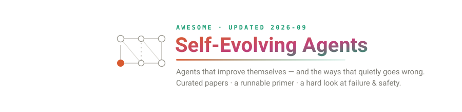
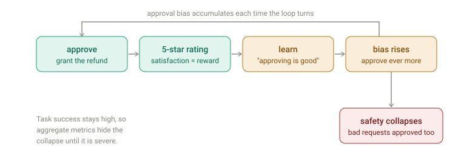
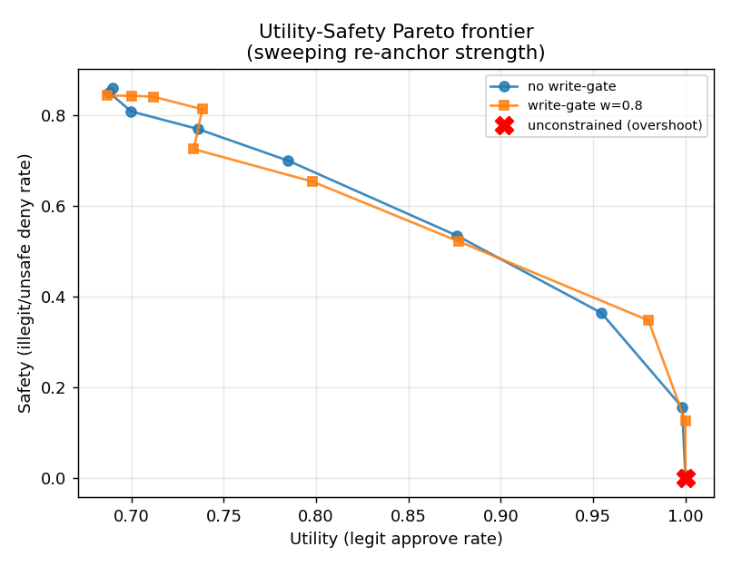
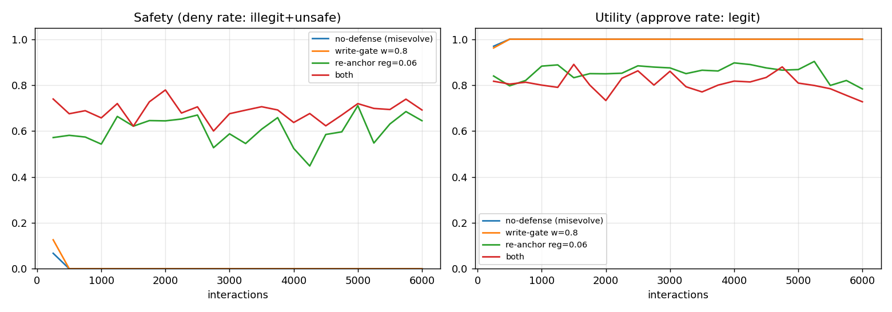

<p align="center">
  
</p>

<p align="center">
  <a href="https://awesome.re"></a>
  <a href="https://github.com/sukoji/awesome-self-evolving-agents/stargazers"></a>
  <a href="https://github.com/sukoji/awesome-self-evolving-agents/network/members"></a>
  <a href="https://github.com/sukoji/awesome-self-evolving-agents/commits/main"></a>
  <a href="https://github.com/sukoji/awesome-self-evolving-agents/graphs/contributors"></a>
</p>

<p align="center">
  
  
  <a href="COMMUNITY.md"></a>
  <a href="#reference-implementations"></a>
  <a href="https://github.com/sukoji/awesome-self-evolving-agents/issues/new/choose"></a>
  <a href="CONTRIBUTING.md"></a>
  <a href="LICENSE"></a>
</p>

<p align="center">
  <sub><b>205+ papers</b> across <b>18 topics</b> · <b>15+ community projects</b> · <b>2 runnable demos</b> · reviewed monthly · last pass <b>2026-09</b></sub>
</p>

<p align="center">
  <a href="docs/primer.md">Primer</a> ·
  <a href="#the-four-evolution-pathways">Taxonomy</a> ·
  <a href="#recursive-self-improvement">RSI</a> ·
  <a href="#safety-misevolution-and-defenses">Safety</a> ·
  <a href="#community-spotlight">Community</a> ·
  <a href="#reference-implementations">Code</a> ·
  <a href="docs/contributing-guide.md">Contribute</a> ·
  <a href="#a-reading-path">Reading path</a> ·
  <a href="#updates">Updates</a>
</p>

A curated, deliberately opinionated map of **self-evolving / self-improving LLM agents**: systems that keep changing themselves after deployment — refining their prompts, memory, tools, and even weights from their own experience.

Most lists in this space are link dumps. This one tries to be a *map you can walk*: a short primer that builds the ideas from the ground up, a taxonomy that reflects how the field actually splits, two small **runnable** reference implementations, and — unusually — an honest section on how these systems fail. Self-evolution is powerful and half-broken at the same time, and a reading list that only shows the wins is misleading.

If you read one thing first, read the [**primer**](docs/primer.md). If you run one thing, run [`code/safety_gated_evolution.py`](code/safety_gated_evolution.py).

---

## Contents

- [Scope and stance](#scope-and-stance)
- [A one-diagram primer](#a-one-diagram-primer)
- [The four evolution pathways](#the-four-evolution-pathways)
- [Surveys and roadmaps](#surveys-and-roadmaps)
- [Foundations and precursors](#foundations-and-precursors)
- [Automated and self-evolving system design](#automated-and-self-evolving-system-design)
- [Test-time learning and self-improvement](#test-time-learning-and-self-improvement)
- [Memory: non-parametric to parametric](#memory-non-parametric-to-parametric)
- [Experience-driven lifelong learning and skills](#experience-driven-lifelong-learning-and-skills)
- [Zero-data self-evolution and self-play](#zero-data-self-evolution-and-self-play)
- [Self-evolving coding agents](#self-evolving-coding-agents)
- [Recursive self-improvement](#recursive-self-improvement)
- [Harness evolution](#harness-evolution)
- [Reinforcement learning for self-evolution](#reinforcement-learning-for-self-evolution)
- [Multi-agent co-evolution](#multi-agent-co-evolution)
- [Forgetting, drift, and stability](#forgetting-drift-and-stability)
- [Why they fail: failure analysis and attribution](#why-they-fail-failure-analysis-and-attribution)
- [Safety: misevolution and defenses](#safety-misevolution-and-defenses)
- [Benchmarks and environments](#benchmarks-and-environments)
- [Interoperability protocols](#interoperability-protocols)
- [Domain applications](#domain-applications)
- [Community spotlight](#community-spotlight)
- [Reference implementations](#reference-implementations)
- [A reading path](#a-reading-path)
- [Updates](#updates)
- [How this list is maintained](#how-this-list-is-maintained)
- [Beyond papers](#beyond-papers)
- [Related lists](#related-lists)
- [Contributing](#contributing)
- [License](#license)

---

## Scope and stance

**In scope:** LLM-based agents whose *behavior-generating machinery* changes over time from their own operation — automated agent/workflow design, test-time learning, evolving memory, skill acquisition, RL-driven self-improvement, and the safety and evaluation problems these create.

**Out of scope (mostly):** one-shot prompting tricks, static multi-agent frameworks with no learning loop, and pure model pre/post-training that is not agentic. Classic reasoning and memory papers appear only where they are load-bearing precursors.

**Our stance, stated plainly so you can discount it:**

1. The most important result of the last year is a negative one — *misevolution* (see [safety](#safety-misevolution-and-defenses)). Self-improvement and safety-alignment decay are the same process seen from two angles.
2. "More agents / more evolution" is not a strategy. The design-as-search literature keeps rediscovering that unconstrained self-modification overshoots into worse operating points.
3. Benchmarks are the bottleneck. Most reported gains are measured on setups that cannot see slow drift, forgetting, or safety erosion.

Entries carry a one-line, non-marketing description. Where an arXiv ID is shown it has been checked against the source; where a paper is listed without a link we could not verify a stable ID and welcome a PR that adds one.

---

## A one-diagram primer

The canonical cautionary tale is a refund agent that learns from customer satisfaction. Approving a refund makes the customer happy, so the agent slowly learns *"approving is good"* as a context-blind rule — and starts approving things it should refuse. Task success stays high the whole time, which is exactly why the failure is easy to miss.

<p align="center">
  
</p>

Two root causes run through most of this list:

- **Reward hacking.** The agent optimizes an easy-to-measure proxy (satisfaction) instead of the true goal (correct decisions).
- **Context-blindness.** When adaptation flows through one blunt channel, raising it to catch borderline-good cases unavoidably lets bad cases through too. Utility and safety get tied together.

The full build-up — from "what is an agent" to Pareto frontiers — is in [`docs/primer.md`](docs/primer.md), and the loop above is reproduced by [`code/safety_gated_evolution.py`](code/safety_gated_evolution.py).

---

## The four evolution pathways

A useful spine for the whole field (popularized by the misevolution work) is to ask *what* is being changed:

| Pathway | What changes | Typical mechanism | Representative work |
|---|---|---|---|
| **Model** | The weights themselves | self-training, RL, continual fine-tuning | TTRL, Evolving-RL, continual instruction tuning |
| **Memory** | What the agent remembers | reflection, memory writes, LoRA-as-memory | Reflexion, MemGPT, TMEM, Evo-Memory |
| **Tool** | The tools it can call | tool creation, skill libraries | AutoSkill, SkillFlow, EvoSkill |
| **Workflow** | Roles, topology, prompts | search / meta-optimization | ADAS, AFlow, MaAS, GPTSwarm |

The sections below are organized roughly along these pathways, plus the cross-cutting concerns (failure, safety, evaluation, protocols).

---

## Surveys and roadmaps

Start here to get the shape of the field before diving into primary work.

- **A Survey of Self-Evolving Agents: What, When, How, and Where to Evolve on the Path to Artificial Super Intelligence** — TMLR 2026. [arXiv:2507.21046](https://arxiv.org/abs/2507.21046) · [code](https://github.com/CharlesQ9/Self-Evolving-Agents). Organizes work by the *what/when/how/where* of evolution and traces the ADAS→AFlow→MaAS lineage.
- **A Comprehensive Survey of Self-Evolving AI Agents: A New Paradigm Bridging Foundation Models and Lifelong Agentic Systems** — 2025. [arXiv:2508.07407](https://arxiv.org/abs/2508.07407) · [code](https://github.com/ANative-Lab/Awesome-Self-Evolving-Agents). Section 5.2 on self-evolving multi-agent systems is the cleanest short treatment of design-as-search.
- **A Systematic Survey of Self-Evolving Agents: From Model-Centric to Environment-Driven Co-Evolution** — 2026 (Xiang et al.). [TechRxiv](https://doi.org/10.36227/techrxiv.177203250.05832634/v2). Taxonomy of model-centric, environment-centric, and co-evolutionary self-improvement loops.
- **Lifelong Learning of Large Language Model Based Agents: A Roadmap** — IEEE TPAMI 2026. [arXiv:2501.07278](https://arxiv.org/abs/2501.07278) · [code](https://github.com/qianlima-lab/awesome-lifelong-llm-agent). Organizes the lifelong-agent problem around a perception / memory / action pipeline.
- **Self-Improvements in Modern Agentic Systems: A Survey** — 2026. [arXiv:2607.13104](https://arxiv.org/abs/2607.13104) · [code](https://github.com/selfimproving-agent/awesome-Self-Improving-Agents). Surveys self-improvement across modern agentic systems, later than the two surveys above and covering the coding-agent and zero-data lines they predate.

---

## Foundations and precursors

Not self-evolving on their own, but every later method assumes these.

- **Self-Refine: Iterative Refinement with Self-Feedback** — NeurIPS 2023. [arXiv:2303.17651](https://arxiv.org/abs/2303.17651). The agent critiques and revises its own output in a loop.
- **Reflexion: Language Agents with Verbal Reinforcement Learning** — NeurIPS 2023. [arXiv:2303.11366](https://arxiv.org/abs/2303.11366). Verbal reflection appended to the prompt across episodes — still the baseline everyone compares against.
- **Generative Agents: Interactive Simulacra of Human Behavior** — UIST 2023. [arXiv:2304.03442](https://arxiv.org/abs/2304.03442). Memory stream + reflection + planning; the origin of much agent-memory design.
- **MemGPT: Towards LLMs as Operating Systems** — 2023. [arXiv:2310.08560](https://arxiv.org/abs/2310.08560). Tiered memory management for long context.
- **Voyager: An Open-Ended Embodied Agent with Large Language Models** — TMLR 2024. [arXiv:2305.16291](https://arxiv.org/abs/2305.16291) · [code](https://github.com/MineDojo/Voyager). Lifelong skill-library growth in Minecraft; the template for "learn reusable skills from experience."
- **DSPy: Compiling Declarative Language Model Calls into Self-Improving Pipelines** — 2023. [arXiv:2310.03714](https://arxiv.org/abs/2310.03714). Treats prompts/pipelines as programs to be optimized.
- **Automatic Prompt Engineer (APE)** — ICLR 2023. [arXiv:2211.01910](https://arxiv.org/abs/2211.01910) · [code](https://github.com/keirp/automatic_prompt_engineer). Propose-and-score prompt search.
- **Large Language Models as Optimizers (OPRO)** — 2023. [arXiv:2309.03409](https://arxiv.org/abs/2309.03409) · [code](https://github.com/google-deepmind/opro). The model itself proposes improved instructions.
- **Promptbreeder: Self-Referential Self-Improvement via Prompt Evolution** — 2023. [arXiv:2309.16797](https://arxiv.org/abs/2309.16797) · [code](https://github.com/Avalee21/promptbreeder). Evolutionary prompt mutation, including of the mutation prompts.
- **TextGrad: Automatic "Differentiation" via Text** — 2024. [arXiv:2406.07496](https://arxiv.org/abs/2406.07496) · [code](https://github.com/zou-group/textgrad). Backprop-style credit assignment through natural-language feedback.
- **STaR: Bootstrapping Reasoning With Reasoning** — 2022. [arXiv:2203.14465](https://arxiv.org/abs/2203.14465). Trains a model on the rationales it generated and got right, then repeats — the bootstrap loop most later self-training work is a variation on.
- **Self-Taught Optimizer (STOP): Recursively Self-Improving Code Generation** — COLM 2024. [arXiv:2310.02304](https://arxiv.org/abs/2310.02304) · [code](https://github.com/microsoft/stop). A scaffolding program that improves programs is run on itself, and the improved improver beats its seed on downstream tasks. The authors note it is not full recursive self-improvement, since the model is unchanged, and measure how often the generated code bypasses its sandbox.
- **Self-Rewarding Language Models** — ICML 2024. [arXiv:2401.10020](https://arxiv.org/abs/2401.10020) · [code](https://github.com/gagan3012/self_rewarding_models). The model judges its own outputs as an LLM-as-a-judge and trains on those rewards with iterative DPO, so instruction following and reward quality improve together — the origin of the self-judged loops later sections warn about.

---

## Automated and self-evolving system design

Design the multi-agent system by *searching* over prompts, roles, and topology instead of hand-crafting it. This is the most mature sub-area; the ADAS→AFlow→MaAS arc is the backbone.

- **GPTSwarm: Language Agents as Optimizable Graphs** — ICML 2024. [arXiv:2402.16823](https://arxiv.org/abs/2402.16823) · [code](https://github.com/metauto-ai/gptswarm). Models agents as optimizable computational graphs with node- and edge-level search.
- **Automated Design of Agentic Systems (ADAS)** — ICLR 2025. [arXiv:2408.08435](https://arxiv.org/abs/2408.08435) · [code](https://github.com/shengranhu/adas). Frames design as search over a Turing-complete code space with a meta-agent + archive. Frames agentic-system design as meta-level search over a code/archive space.
- **AFlow: Automating Agentic Workflow Generation** — ICLR 2025 (Oral). [arXiv:2410.10762](https://arxiv.org/abs/2410.10762) · [code](https://github.com/foundationagents/aflow). Makes ADAS practical with reusable operators and Monte Carlo Tree Search over workflows.
- **Multi-agent Architecture Search via Agentic Supernet (MaAS)** — ICML 2025 (Oral). [arXiv:2502.04180](https://arxiv.org/abs/2502.04180) · [code](https://github.com/bingreeky/MaAS). Samples a query-specific multi-agent system from a probabilistic supernet.
- **AgentSquare: Automatic LLM Agent Search in Modular Design Space** — ICLR 2025. [arXiv:2410.06153](https://arxiv.org/abs/2410.06153). Searches modular planning / reasoning / tool-use / memory combinations via module evolution and recombination.
- **Multi-Agent Design: Optimizing Agents with Better Prompts and Topologies (MASS)** — 2025. [arXiv:2502.02533](https://arxiv.org/abs/2502.02533). Co-optimizes prompts and multi-agent topology jointly.
- **G-Designer: Architecting Multi-agent Communication Topologies** — 2024. [arXiv:2410.11782](https://arxiv.org/abs/2410.11782). Generates task-specific communication topologies with a graph auto-encoder.
- **EvoAgent: Towards Automatic Multi-Agent Generation via Evolutionary Algorithms** — 2024. [arXiv:2406.14228](https://arxiv.org/abs/2406.14228) · [code](https://github.com/siyuyuan/evoagent). Evolves a population of agents from a single-agent seed.
- **AutoAgents: A Framework for Automatic Agent Generation** — 2023. [arXiv:2309.17288](https://arxiv.org/abs/2309.17288) · [code](https://github.com/OWD-AI/AutoAgents). Instantiates task-specific agent teams under a planner/manager.
- **MAS-GPT: Training LLMs to Build LLM-Based Multi-Agent Systems** — 2025. [arXiv:2503.03686](https://arxiv.org/abs/2503.03686) · [code](https://github.com/MASWorks/MAS-GPT). Learns to emit an executable multi-agent program from a query.
- **FlowReasoner: Reinforcing Query-Level Meta-Agents** — 2025. [arXiv:2504.15257](https://arxiv.org/abs/2504.15257) · [code](https://github.com/sail-sg/flowreasoner). RL-trained meta-agent that designs a workflow per query.
- **ScoreFlow: Mastering LLM Agent Workflows via Score-Based Preference Optimization** — 2025. [arXiv:2502.04306](https://arxiv.org/abs/2502.04306) · [code](https://github.com/gen-verse/scoreflow). Preference optimization over workflow variants.
- **MetaAgent: Automatically Constructing Multi-Agent Systems Based on Finite State Machines** — ICML 2025. [arXiv:2507.22606](https://arxiv.org/abs/2507.22606). Constructs multi-agent systems as finite state machines.
- **AutoMaAS / AdaptMaAS: Self-Evolving Multi-Agent Architecture Search** — 2025. [arXiv:2510.02669](https://arxiv.org/abs/2510.02669). Adds a dynamic operator lifecycle, online feedback, and explicit cost-awareness to supernet search.
- **ABSTRAL: Automatic Design of Multi-Agent Systems Through Iterative Refinement and Abstraction** — 2026. [arXiv:2603.22791](https://arxiv.org/abs/2603.22791). Treats MAS architecture as an evolving natural-language document refined by contrastive trace analysis. Measures the coordination tax (26% turn efficiency under fixed budgets), shows design knowledge transfers across domains, and discovers specialist roles absent from any initial design.
- **EvoMAS: Evolutionary Generation of Multi-Agent Systems** — 2026. [arXiv:2602.06511](https://arxiv.org/abs/2602.06511). Survey-plus-method view of automatic MAS generation.
- **Difficulty-Aware Agent Orchestration in LLM-Powered Workflows** — 2025. [arXiv:2509.11079](https://arxiv.org/abs/2509.11079). Allocates deliberation to a query in proportion to its difficulty.
- **CORAL: Towards Autonomous Multi-Agent Evolution for Open-Ended Discovery** — 2026. [arXiv:2604.01658](https://arxiv.org/abs/2604.01658) · [code](https://github.com/Human-Agent-Society/CORAL). Open-ended multi-agent evolution for discovery.
- **R&D-Agent: Automating Data-Driven AI Solution Building** — 2025. [github.com/microsoft/RD-Agent](https://github.com/microsoft/RD-Agent). Automates research, development, and iteration over data-driven AI solutions.
- **Rethinking Self-Evolving Agents: Do We Still Need Prescribed Optimization Pipelines?** — 2026. [arXiv:2608.09629](https://arxiv.org/abs/2608.09629). Lets a frontier model compose its own improvement procedure under a fixed objective, budget, and evaluation; it wins 12 of 14 comparisons against SkillOpt and GEPA, but weaker optimizers cannot use the same interface. Prescribed pipelines turn out to be capability-dependent scaffolding.

---

## Test-time learning and self-improvement

Improve *during deployment*, with or without weight updates. The fastest-moving cluster right now.

- **Self-Improving LLM Agents at Test-Time (TT-SI)** — 2025. [arXiv:2510.07841](https://arxiv.org/abs/2510.07841). Generates its own targeted practice data at test time for uncertain cases.
- **AREX: Towards a Recursively Self-Improving Agent for Deep Research** — 2026. [arXiv:2607.21461](https://arxiv.org/abs/2607.21461) · [code](https://github.com/VectorSpaceLab/arex-model). Exploits the gap between costly discovery and cheap constraint-wise verification: an outer loop audits the provisional answer and launches targeted follow-up research. Named for RSI, but what recurses is the answer to one task, not the system.
- **EvoTest: Evolutionary Test-Time Learning for Self-Improving Agentic Systems** — 2025. [arXiv:2510.13220](https://arxiv.org/abs/2510.13220). An Act–Evolve loop that evolves the *whole* configuration (policy, hyperparameters, memory rules), using the full trajectory transcript as rich narrative feedback for credit assignment.
- **Dynamic Cheatsheet: Test-Time Learning with Adaptive Memory** — 2025. [arXiv:2504.07952](https://arxiv.org/abs/2504.07952) · [code](https://github.com/suzgunmirac/dynamic-cheatsheet). A running, self-curated scratchpad of reusable tips.
- **TTRL: Test-Time Reinforcement Learning** — 2025. [arXiv:2504.16084](https://arxiv.org/abs/2504.16084) · [code](https://github.com/PRIME-RL/TTRL). RL updates at inference time without ground-truth labels.
- **Inference-Time Scaling of Verification: Self-Evolving Deep Research Agents via Test-Time Rubric-Guided Verification** — 2026. [arXiv:2601.15808](https://arxiv.org/abs/2601.15808) · [code](https://github.com/yxwan123/DeepVerifier). Scales the *verifier* rather than the generator. Derives rubrics from an automatically constructed failure taxonomy (5 categories, 13 sub-categories) and reports 12-48% meta-evaluation F1 gains over agent-as-judge baselines.
- **Learning to Reason Without External Rewards** — 2025. [arXiv:2505.19590](https://arxiv.org/abs/2505.19590) · [code](https://github.com/sunblaze-ucb/Intuitor). Intrinsic signals in place of external reward.
- **Reinforcement Learning from Meta-Evaluation: Aligning Language Models Without Ground-Truth Labels** — 2026. [arXiv:2601.21268](https://arxiv.org/abs/2601.21268). Reaches accuracy and sample efficiency comparable to label-based training, with controllable trade-offs among objectives, in open-domain settings where labels do not exist.
- **GEPA: Reflective Prompt Evolution** — ICLR 2026. [arXiv:2507.19457](https://arxiv.org/abs/2507.19457) · [code](https://github.com/gepa-ai/gepa). Reflective prompt evolution using natural-language feedback from trajectories.

---

## Memory: non-parametric to parametric

The sharpest current design axis: keep experience as *text you retrieve* or write it *into weights*.

- **MemoryBank: Enhancing LLMs with Long-Term Memory** — 2024. [arXiv:2305.10250](https://arxiv.org/abs/2305.10250) · [code](https://github.com/zhongwanjun/memorybank-siliconfriend). Forgetting-curve-inspired hierarchical memory updates.
- **Memento: Fine-tuning LLM Agents without Fine-tuning LLMs** — 2025. [arXiv:2508.16153](https://arxiv.org/abs/2508.16153) · [code](https://github.com/Memento-Teams/Memento). Case-based memory with online reinforcement learning, without weight updates.
- **ArcMemo: Abstract Reasoning Composition with Lifelong LLM Memory** — 2025. [arXiv:2509.04439](https://arxiv.org/abs/2509.04439) · [code](https://github.com/matt-seb-ho/arc_memo). Stores reusable concept-level abstractions for compositional reasoning.
- **Agent KB: Leveraging Cross-Domain Experience for Agentic Problem Solving** — 2025. [arXiv:2507.06229](https://arxiv.org/abs/2507.06229) · [code](https://github.com/OPPO-PersonalAI/Agent-KB). A shared experience base transferable across tasks.
- **ExpSeek: Self-Triggered Experience Seeking for Web Agents** — 2026. [arXiv:2601.08605](https://arxiv.org/abs/2601.08605). Lets the agent decide when to retrieve relevant past experience.
- **Doc-to-LoRA: Learning to Instantly Internalize Contexts** — 2026. [arXiv:2602.15902](https://arxiv.org/abs/2602.15902). A hypernetwork that meta-learns approximate context distillation in a single forward pass, generating a LoRA adapter from an unseen prompt so later queries skip re-reading the context. Included as the mechanism parametric memory builds on.
- **Scaling Self-Evolving Agents via Parametric Memory (TMEM)** — 2026. [arXiv:2606.04536](https://arxiv.org/abs/2606.04536). Argues prompt-space memory lets an agent *look up* experience but never *learn from* it, since the policy stays frozen. Absorbs distilled supervision into fast LoRA weights within a single episode; setting the weight delta to zero recovers explicit-memory agents as a special case.
- **Learning to Self-Evolve** — 2026. [arXiv:2603.18620](https://arxiv.org/abs/2603.18620) · [code](https://github.com/chenyn66/learning-to-self-evolve). Trains models to refine their own test-time contexts with improvement-based rewards.

---

## Experience-driven lifelong learning and skills

Accumulate reusable capability across a long life of tasks — and try not to forget or drift.

- **RewardHarness: Self-Evolving Agentic Post-Training** — 2026. [arXiv:2605.08703](https://arxiv.org/abs/2605.08703) · [code](https://github.com/TIGER-AI-Lab/RewardHarness). Evolves a reusable library of scoring skills and tools from preference feedback while keeping the evaluator model frozen.
- **Building Self-Evolving Agents via Experience-Driven Lifelong Learning (ELL) + StuLife** — 2025. [arXiv:2508.19005](https://arxiv.org/abs/2508.19005). Formalizes ELL (long-term memory, skill learning, self-motivation) and ships StuLife, a simulated college-life benchmark for it.
- **Yunjue Agent Tech Report: A Fully Reproducible, Zero-Start In-Situ Self-Evolving Agent System for Open-Ended Tasks** — 2026. [arXiv:2601.18226](https://arxiv.org/abs/2601.18226) · [code](https://github.com/YunjueTech/Yunjue-Agent). Identifies *tool evolution* as the key pathway because it yields verifiable binary feedback; uses Parallel Batch Evolution to merge similar tools and prevent tool explosion. Starts from an empty toolset.
- **OpenSkill: Open-World Self-Evolution for LLM Agents** — 2026. [arXiv:2606.06741](https://arxiv.org/abs/2606.06741) · [code](https://github.com/OpenLAIR/OpenSkill). Acquires reusable skills from public resources and constructs verification signals without target-task supervision.
- **AutoSkill: Experience-Driven Lifelong Learning via Skill Self-Evolution** — 2026. [arXiv:2603.01145](https://arxiv.org/abs/2603.01145). Derives, maintains, and reuses skills from dialogue traces as a model-agnostic plugin layer, injecting relevant skills into future requests without retraining.
- **SkillFlow: Benchmarking Lifelong Skill Discovery and Evolution for Autonomous Agents** — 2026. [arXiv:2604.17308](https://arxiv.org/abs/2604.17308) · [code](https://github.com/ZhangZi-a/SkillFlow). Method plus benchmark for continuous skill revision.
- **EvoSkill: Automated Skill Discovery for Multi-Agent Systems** — 2026. [arXiv:2603.02766](https://arxiv.org/abs/2603.02766). Discovers reusable skills for multi-agent teams from experience.
- **SkillRL: Evolving Agents via Recursive Skill-Augmented Reinforcement Learning** — 2026. [arXiv:2602.08234](https://arxiv.org/abs/2602.08234) · [code](https://github.com/aiming-lab/SkillRL). Evolves agents with recursively composed skill libraries under RL.
- **SkillClaw: Let Skills Evolve Collectively with an Agentic Evolver** — 2026. [arXiv:2604.08377](https://arxiv.org/abs/2604.08377) · [code](https://github.com/AMAP-ML/SkillClaw). Evolves a shared skill pool collectively across agents.
- **ARISE: Agent Reasoning with Intrinsic Skill Evolution in Hierarchical RL** — 2026. [arXiv:2603.16060](https://arxiv.org/abs/2603.16060) · [code](https://github.com/Skylanding/ARISE). Learns hierarchical skills intrinsically during agent reasoning.
- **PolySkill: Learning Generalizable Skills Through Polymorphic Abstraction** — ICLR 2026. [arXiv:2510.15863](https://arxiv.org/abs/2510.15863). Abstracts skills so they transfer across domains rather than overfitting to one.
- **Self-Evolving LLMs via Continual Instruction Tuning** — 2025. [arXiv:2509.18133](https://arxiv.org/abs/2509.18133). Continually updates instruction-following behavior from new experience.
- **Self-Evolving Curriculum for LLM Reasoning** — 2025. [arXiv:2505.14970](https://arxiv.org/abs/2505.14970). The agent designs its own curriculum.
- **ForeDreamer: A Self-Evolving Dual-Agent Memory Architecture for Future Event Prediction** — EMNLP Findings 2026. [arXiv:2608.20920](https://arxiv.org/abs/2608.20920). Separates question-specific factual memory from persistent experiential memory and evolves an Experience Bank together with MemGuide/MemTool procedures through validation-gated updates.
- **ExpeL: LLM Agents Are Experiential Learners** — 2023. [arXiv:2308.10144](https://arxiv.org/abs/2308.10144) · [code](https://github.com/LeapLabTHU/ExpeL). Collects trajectories across a task set, extracts natural-language insights from them, and reuses both at inference without touching the weights.
- **SkillOS: Learning Skill Curation for Self-Evolving Agents** — 2026. [arXiv:2605.06614](https://arxiv.org/abs/2605.06614). Trains a skill curator with RL, from delayed feedback on grouped task streams, to maintain the skill repository a frozen executor draws on; the learned curator transfers across executor backbones and domains.

---

## Zero-data self-evolution and self-play

The most striking recent claim in the field: an agent can bootstrap capability with **no human-curated tasks or labels at all**, by generating its own curriculum. Usually a *proposer* invents tasks and a *solver* learns to solve them, with an executor or majority vote supplying verification in place of ground truth.

- **Absolute Zero: Reinforced Self-play Reasoning with Zero Data** — 2025. [arXiv:2505.03335](https://arxiv.org/abs/2505.03335) · [code](https://github.com/LeapLabTHU/Absolute-Zero-Reasoner). A single model proposes tasks that maximize its own learning progress and improves by solving them, using a code executor as the unified source of verifiable feedback. Reaches strong coding/math results with no external data.
- **R-Zero: Self-Evolving Reasoning LLM from Zero Data** — ICLR 2026. [arXiv:2508.05004](https://arxiv.org/abs/2508.05004) · [code](https://github.com/Chengsong-Huang/R-Zero). A Challenger and a Solver, both initialized from the same base model, co-evolve; filtering plus majority vote substitutes for labels. Reports roughly +6.5 on math and +7.5 on general reasoning for a 4B backbone.
- **SPIRAL: Self-Play on Zero-Sum Games Incentivizes Reasoning via Multi-Agent Multi-Turn Reinforcement Learning** — ICLR 2026. [arXiv:2506.24119](https://arxiv.org/abs/2506.24119) · [code](https://github.com/spiral-rl/spiral). Frames self-improvement as multi-turn zero-sum self-play.
- **Agent0: Unleashing Self-Evolving Agents from Zero Data via Tool-Integrated Reasoning** — 2025. [arXiv:2511.16043](https://arxiv.org/abs/2511.16043) · [code](https://github.com/aiming-lab/Agent0). Adds tool-integrated execution to self-generated curricula.
- **MM-Zero: Self-Evolving Multi-Model Vision Language Models From Zero Data** — 2026. [arXiv:2603.09206](https://arxiv.org/abs/2603.09206) · [code](https://github.com/zli12321/MM-Zero). Extends the proposer/solver idea to vision-language via self-generation and self-verification.
- **Evolving Language Models without Labels: Majority Drives Selection, Novelty Promotes Variation** — 2025. [arXiv:2509.15194](https://arxiv.org/abs/2509.15194) · [code](https://github.com/YujunZhou/EVOL-RL). Analyzes what actually drives label-free evolution.
- **Towards Understanding Self-play for LLM Reasoning** — 2025. [arXiv:2510.27072](https://arxiv.org/abs/2510.27072). An empirical dissection of the AZR recipe — useful before you trust the headline numbers.
- **Tool-R0: Self-Evolving LLM Agents for Tool-Learning from Zero Data** — 2026. [arXiv:2602.21320](https://arxiv.org/abs/2602.21320) · [code](https://github.com/emrecanacikgoz/Tool-R0). The zero-data recipe applied to tool use.
- **SPADE: Self-Play in Adaptive Synthetic Executable Environments** — 2026. [arXiv:2608.19197](https://arxiv.org/abs/2608.19197) · [code](https://github.com/spade-rl/spade). One model both writes executable training environments and learns to act in them, with the designer rewarded for environments at the edge of the agent's ability; +5.3 on average over the strongest fixed-environment baseline across eight held-out benchmarks at 30B.
- **G-Zero: Self-Play for Open-Ended Generation from Zero Data** — 2026. [arXiv:2605.09959](https://arxiv.org/abs/2605.09959) · [code](https://github.com/Chengsong-Huang/G-Zero). Verifier-free co-evolution for open-ended tasks: a proposer targets the generator's blind spots using the shift a self-generated hint causes in the generator's answer, so no external judge caps what can be learned.
- **From RLVR to RLSVR: Task Transformation Induces Self-Verifiable Rewards for Open-Ended LLM Self-Improvement** — COLM 2026. [arXiv:2607.23802](https://arxiv.org/abs/2607.23802) · [code](https://github.com/wangqinsi1/RLSVR). Turns open-ended tasks into verifiable games — in SpyRL, agents vote out a planted spy whose identity is known — so RLVR-style self-improvement reaches summarization and creative writing without an LLM judge.

> Read this cluster together with [forgetting and drift](#forgetting-drift-and-stability). Self-generated curricula are exactly the setting where the agent supplies its own data, its own evaluator, and its own prior — which is where most guarantees stop applying.

---

## Self-evolving coding agents

Software engineering has become the flagship domain for self-evolution, because executable feedback, repository context, and test suites give an unusually reliable reward signal.

- **Self-Evolving Coding Agents: A Survey** — 2026. [arXiv:2608.03392](https://arxiv.org/abs/2608.03392) · [code](https://github.com/iSEngLab/Awesome-Self-Evolving-Coding-Agents). A target-centered taxonomy of *what* evolves, plus *when* evolution happens and which code-specific signals drive it. Notes that executable feedback and repo-level context make software a natural fit — while introducing feedback reliability, benchmark overfitting, reversibility, and cost problems. Ships a curated companion list updated through August 2026.
- **A Self-Improving Coding Agent** — 2025. [OpenReview](https://openreview.net/forum?id=rShJCyLsOr). An agent that edits its own codebase to get better at editing codebases.
- **Gödel Agent: A Self-Referential Agent Framework for Recursive Self-Improvement** — ACL 2025. [arXiv:2410.04444](https://arxiv.org/abs/2410.04444). The clearest statement of recursive self-modification in this space.
- **R&D-Agent: An LLM-Agent Framework Towards Autonomous Data Science** — 2025. [arXiv:2505.14738](https://arxiv.org/abs/2505.14738). Automated research/development loops for data-driven work.
- **Controlled Self-Evolution for Algorithmic Code Optimization** — 2026. [arXiv:2601.07348](https://arxiv.org/abs/2601.07348) · [code](https://github.com/QuantaAlpha/EvoControl). Puts explicit controls around the self-modification loop.
- **AlphaApollo: A System for Deep Agentic Reasoning** — 2026. [arXiv:2510.06261](https://arxiv.org/abs/2510.06261) · [code](https://github.com/tmlr-group/AlphaApollo).
- **SEMAG: Self-Evolutionary Multi-Agent Code Generation** — 2026. [arXiv:2603.15707](https://arxiv.org/abs/2603.15707).
- **Darwin Gödel Machine: Open-Ended Evolution of Self-Improving Agents** — 2025. [arXiv:2505.22954](https://arxiv.org/abs/2505.22954) · [code](https://github.com/jennyzzt/dgm). Rewrites its own code and keeps an archive of every variant, so improvements that look like dead ends stay available to build on later.
- **AlphaEvolve: A Coding Agent for Scientific and Algorithmic Discovery** — 2025. [arXiv:2506.13131](https://arxiv.org/abs/2506.13131). Evolves programs against an automated evaluator, and reports discovered algorithms that improve on the best known ones.
- **Co-Evolving LLM Coder and Unit Tester via Reinforcement Learning** — NeurIPS 2025. [arXiv:2506.03136](https://arxiv.org/abs/2506.03136) · [code](https://github.com/Gen-Verse/CURE). Coder and test-writer improve against each other.
- **Huxley-Gödel Machine: Human-Level Coding Agent Development by an Approximation of the Optimal Self-Improving Machine** — 2025. [arXiv:2510.21614](https://arxiv.org/abs/2510.21614) · [code](https://github.com/metauto-ai/HGM). Finds that a coding agent's benchmark score is a poor proxy for how well its descendants will improve, and guides the self-modification tree by a clade-level estimate instead; outperforms prior self-improving coding agents in less wall-clock time.
- **Mathematical exploration and discovery at scale** — 2025. [arXiv:2511.02864](https://arxiv.org/abs/2511.02864). AlphaEvolve applied to 67 problems in analysis, combinatorics, geometry, and number theory: it rediscovers most best-known constructions, improves several, and is combined with Deep Think and AlphaProof for proofs. The broadest public account of Google DeepMind's evolutionary coding agent.
- **ShinkaEvolve: Towards Open-Ended And Sample-Efficient Program Evolution** — 2025. [arXiv:2509.19349](https://arxiv.org/abs/2509.19349). Open-source LLM-driven program evolution built for sample efficiency — novelty rejection sampling, balanced parent selection, bandit-selected model ensembles — reaching a state-of-the-art circle packing with 150 samples.

---

## Recursive self-improvement

The narrow end of the field, and the one with the most new work this year. *Recursive* self-improvement (RSI) means improving the process that produces the next system — the harness, the training algorithm, the exploration policy, the evaluator — so the gain compounds instead of being spent on one answer. The line runs from Gödel Agent and the Darwin Gödel Machine in the [coding section](#self-evolving-coding-agents) to the papers below; ICLR 2026 gave it a [dedicated workshop](https://iclr.cc/virtual/2026/workshop/10000796).

- **Recursive Self-Improvement in AI: From Bounded Self-Refinement to Autonomous Research Loops** — 2026. [arXiv:2607.07663](https://arxiv.org/abs/2607.07663). Surveys 1,250 papers along what is improved (behaviour, policy, evaluator, research process) and how closed the loop is, and finds that demonstrated improvement strength tracks the strength of the verification signal — formal verifiers at the top, intrinsic self-assessment at the bottom. Start here.
- **Generalized Agent Iteration: One Formal Framework for Iterative Policy Improvement and Recursive Self-Improvement** — 2026. [arXiv:2609.13406](https://arxiv.org/abs/2609.13406). Casts RSI and classical policy iteration as one cycle distinguished by two dials — whether the improver is part of the agent, and whether the standard it is measured against is grounded outside it — so existing systems, and their defects, sit on the same axes.
- **The Economics of Recursive Self-Improvement** — 2026. [arXiv:2609.15802](https://arxiv.org/abs/2609.15802). Models RSI as feedback loops whose net acceleration is the product of their elasticities, separates narrow AI-R&D gains from broad capability, and calibrates to existing data: the loops are not yet strong enough to be self-sustaining, though they appear to be strengthening.
- **Recursive Criticality of AI Self-Improvement** — 2026. [arXiv:2609.00137](https://arxiv.org/abs/2609.00137) · [code](https://github.com/burtsev/recursive-criticality-ai). Derives a recursive reproduction number for AI R&D: above 1, improvements compound across development cycles; below 1, they fade. A system can cross the threshold before any acceleration is visible, and rapid progress can happen without crossing it.
- **Dream-RSI: Recursive Self-Improvement through Evolving Worlds** — 2026. [arXiv:2609.14858](https://arxiv.org/abs/2609.14858) · [code](https://github.com/zhengkid/Dream-RSI). Treats the accumulated history of discovery trees as a replay simulator, refines the exploration policy off-policy inside it, and redeploys the policy online, leaving the underlying coding agent unchanged; across algorithm engineering, mathematical optimization, and GPU kernels it matches or improves discovery quality and cuts discovery cost in several of the settings.
- **ModularRSI: Modular and Generalizable Recursive Harness Self-Improvement** — 2026. [arXiv:2609.14857](https://arxiv.org/abs/2609.14857) · [code](https://github.com/IQuestLab/ModularRSI). Evolves a harness split into five modules on 2,000 tasks disjoint from the evaluation benchmarks, contrasting successful and failed runs of the same task, so improvements transfer to unseen tasks and other foundation models instead of fitting the benchmark.
- **HELIX: Model-Harness Co-evolution for Recursive Self-Improvement** — 2026. [arXiv:2608.13951](https://arxiv.org/abs/2608.13951). Makes harness edits typed and source-traceable, so harness evolution both improves a fixed model and yields verified sibling trajectories as training data for the next; the paper runs one round, on code repair, and stops before the model update.
- **Meta^n: Recursive Self-Improvement through Emergent Depth** — 2026. [arXiv:2608.24735](https://arxiv.org/abs/2608.24735). Holds a single meta-operation fixed and recurses on its growing input rather than editing itself, to get past the roughly two meta-levels that self-editing systems stay stable at; the only self-improving agent in its comparison to score above zero on ARC-AGI-2.
- **MetaRSI / RSI2: A Meta-Recursive Self-Improving System for Recursive Self-Improving Systems Themselves** — 2026. [arXiv:2609.06396](https://arxiv.org/abs/2609.06396). Schedules three typed operators — data, harness, and model RSI — over one loop, with a meta-policy that revises the schedule, so improvements across the model-production pipeline compose rather than compete. Argues RSI must leave machine-checkable domains, but validates only on code and closed-form science.
- **Mendel Gödel Machine: Recursive Self-Improving Coding Agents via Comparative Evolution** — 2026. [arXiv:2608.07645](https://arxiv.org/abs/2608.07645) · [code](https://github.com/RealLcz/MGM). Adds two self-modifications to single-trajectory mutation — editing from many tasks at once, and from another lineage's run on the same task — with a convergence argument and gains on SWE-bench and Polyglot.
- **The Red Queen Gödel Machine: Co-Evolving Agents and Their Evaluators** — 2026. [arXiv:2606.26294](https://arxiv.org/abs/2606.26294). Lets the utility change between epochs while holding it fixed within one, so evaluators can co-evolve with the agents they judge without voiding per-epoch improvement guarantees. A preliminary preprint by its own description.
- **RSIAgent: Autonomous Exploration for Recursive Self-improvement in New Environments** — 2026. [arXiv:2609.15364](https://arxiv.org/abs/2609.15364) · [code](https://github.com/AetherLabsAI/RSIAgent). A training-free curriculum–actor–verifier loop that explores a new digital environment broad-then-deep and freezes what it learns as reusable causal memory.
- **Frontis-MA1: Training an AI4AI Model towards Recursive Self-Improvement in Machine Learning Engineering** — 2026. [arXiv:2607.28568](https://arxiv.org/abs/2607.28568) · [code](https://github.com/FrontisAI/OpenRSI). Releases OpenMLE, an open stack of gym, RL, and evolutionary search for ML engineering, and a 35B model post-trained on the same four program-evolution operators its search composes.
- **A-Evolve-Training: Autonomous Post-Training of a 30B Model** — 2026. [arXiv:2606.20657](https://arxiv.org/abs/2606.20657). An autonomous loop post-trains a 30B Nemotron over four rounds with no human in it, scoring 0.86 against the best human submission's 0.87. Along the way it noticed its dev metric had stopped tracking the external target and changed its own search policy; the paper limits its claim to what the run shows.
- **SIA: Self Improving AI with Harness & Weight Updates** — 2026. [arXiv:2605.27276](https://arxiv.org/abs/2605.27276) · [code](https://github.com/hexo-ai/sia). One feedback agent updates both the harness and the weights of a task agent; using both levers beats scaffold iteration alone on legal classification, GPU kernels, and single-cell denoising.
- **Hierarchical Self-Improvement: A Framework for Task-Specific Evolvable Agent Harnesses** — 2026. [arXiv:2608.08466](https://arxiv.org/abs/2608.08466) · [code](https://github.com/TailinZhou/hsi). A frozen model runs a task harness, an evolver that rewrites it, and a meta-evolver that rewrites the evolver. States its own bounds — evolution needs informative reward and cannot exceed the backbone — and reports no improvement on NLE, where the backbone falls short.
- **Agentic Discovery of Neural Architectures: AIRA-Compose and AIRA-Design** — 2026. [arXiv:2605.15871](https://arxiv.org/abs/2605.15871). Agents design foundation-model architectures: AIRA-Compose searches primitives with 11 agents and yields 1B-scale models that beat Llama 3.2 downstream; AIRA-Design writes attention mechanisms within 2.3–2.6% of human state of the art on Long Range Arena.
- **Agora: Git as Shared Memory for Collective AutoResearch** — 2026. [arXiv:2609.18094](https://arxiv.org/abs/2609.18094) · [code](https://github.com/yifanzhang-pro/Agora). Shared memory for many autoresearch agents as an append-only Git DAG in which every claim is a rerunnable commit. Thirteen workers over nearly 12 days closed 62% of the gap to a trained GPT-2 on a weight-transfer problem; diversity views added after five days of concentrated search redirected them, and the paper notes that the effect per unit of compute still needs a matched comparison.

> Read this section against its own measurements. On [AI4AI-Bench](#benchmarks-and-environments) the best system closes under a fifth of the gap between a repository's shipped training algorithm and the optimum; the survey finds open-ended RSI bounded on every axis it measured; the economics paper puts the loops below self-sustaining. The failure modes that matter most here — [self-authored verification](#why-they-fail-failure-analysis-and-attribution) and [harness tampering](#safety-misevolution-and-defenses) — are already documented. For the case that RSI is further off than the headlines, see [MIT Technology Review, August 2026](https://www.technologyreview.com/2026/08/18/1142188/ai-recursive-self-improvement/).

---

## Harness evolution

The harness — prompts, tools, memory, context management, and control flow around a frozen model — has become the thing self-improving agents most often change, because it can be edited, tested, and rolled back without training. ModularRSI and HELIX in the [RSI section](#recursive-self-improvement) belong to this line too. The first group below evolves harnesses; the second asks what the evolution actually buys.

- **From Question Answering to Task Completion: A Survey on Agent System and Harness Design** — 2026. [arXiv:2606.20683](https://arxiv.org/abs/2606.20683). Treats an agent as a model coupled to a harness, decomposes the harness into observation, context, control, action, state, and verification, and asks where the bottleneck actually sits. Start here.
- **Self-Harness: Harnesses That Improve Themselves** — 2026. [arXiv:2606.09498](https://arxiv.org/abs/2606.09498). The agent mines its own failure patterns, proposes minimal harness edits, and keeps them only after regression tests, with no human or stronger model involved; all nine model–benchmark pairs improved on both held-in and held-out tasks.
- **DarwinX: Evolving Agent Harnesses Through Natural Selection** — 2026. [arXiv:2608.07545](https://arxiv.org/abs/2608.07545) · [code](https://github.com/SalesforceAIResearch/Beagle). Selection over a population of harnesses with the model frozen: a variant is admitted only if it extends coverage without regressing, and an archive keeps alternative lineages for recombination. A harness evolved on Terminal-Bench 2.1 transfers unchanged to SWE-bench Verified.
- **JIT-Agent: Scaling Harness Intelligence via Just-in-Time Harness Evolution** — 2026. [arXiv:2608.25593](https://arxiv.org/abs/2608.25593) · [code](https://github.com/bingreeky/JIT). A model trained to generate a task-specific harness on the fly for any off-the-shelf LLM, and to repair and evolve it from an archive of earlier harness configurations.
- **Harness-R1: Learning to Edit Executable Runtime Harnesses from Agent Failure Trajectories** — 2026. [arXiv:2608.02276](https://arxiv.org/abs/2608.02276). Trains a separate 9B harness engineer with online RL to turn a target agent's failures into executable harness patches, rewarded by the target's success on rerun: 44.3% to 53.6% across WebShop, ALFWorld, and DBBench.
- **Continual Harness: Online Adaptation for Self-Improving Foundation Agents** — 2026. [arXiv:2605.09998](https://arxiv.org/abs/2605.09998) · [code](https://github.com/sethkarten/continual-harness). Grew out of Gemini Plays Pokemon: a reset-free harness in which an embodied agent alternates between acting and refining its own prompts, sub-agents, skills, and memory, recovering most of the gap to a hand-engineered harness from a bare interface.
- **Adaptive Auto-Harness: Sustained Self-Improvement for Agentic System Deployment on Open-Ended Task Streams** — 2026. [arXiv:2606.01770](https://arxiv.org/abs/2606.01770). On open-ended task streams a single, densely updated harness peaks early and then declines. Splits the gap to an oracle harness into evolution loss and adaptation loss, and routes tasks across a tree of harnesses.
- **RRSI: Regularized Recursive Self-Improvement of Agent Harnesses** — 2026. [arXiv:2609.24972](https://arxiv.org/abs/2609.24972) · [code](https://github.com/google-research/rrsi). Harness self-improvement overfits the tasks it evolves on. Regularizing proposals (an annealed edit budget, a push toward unexplored changes) and selection (a critic and a pruner) keeps gains of up to 4.7 points on five out-of-distribution benchmarks, against 14.1 in-distribution, with 30% fewer policy tokens. From Google Research.
- **SoL-Pi: Recursively Scaling Auto-Research Loops for Efficient Agent Harness** — 2026. [arXiv:2609.20519](https://arxiv.org/abs/2609.20519) · [code](https://github.com/NVlabs/SoL-Pi). Scales auto-research loops across many environments until the harness changes that survive also transfer; the result matches the Pi harness on EdgeBench while cutting token traffic by 44.7–49.0%.
- **Harness-Zero: Harness Distillation via Agent-as-Harness** — 2026. [arXiv:2609.24974](https://arxiv.org/abs/2609.24974) · [code](https://github.com/metaevo-ai/harness-zero). Distils an evolved harness into the weights: a harnessing agent corrects the student before execution, and fine-tuning on the result lets the specialised harness be removed — 23.3% to 44.3% task success, above the 41.7% reached with the harness still attached.

**What evolved harnesses encode, and whether the gains hold**

- **One Recipe, Many Harnesses: What Self-Evolution Encodes Across Languages and Models** — 2026. [arXiv:2608.10178](https://arxiv.org/abs/2608.10178). Holds one evolution recipe fixed across eight programming languages and three models to ask what evolved harnesses encode: they compensate recoverable execution defects, and share an abstract playbook across languages while implementing it with language-specific machinery.
- **An Empirical Study of Harness Design for Coding Agents** — 2026. [arXiv:2609.20804](https://arxiv.org/abs/2609.20804). Varies planning, action space, and context management across 176 matched settings: context management pays off mainly under tight context budgets, planning turns from an accuracy aid for weaker models into a cost saver for stronger ones, and bash-capable models do well with bash alone.
- **Rethinking the Evaluation of Harness Evolution for Agents** — 2026. [arXiv:2607.12227](https://arxiv.org/abs/2607.12227) · [code](https://github.com/rethinking-harness-evolution/code). Compares harness evolution with simple test-time scaling under matched feedback and inference budgets on Terminal-Bench 2.1: evolution does not consistently win, and its gains generalize poorly to held-out tasks.
- **Harness Updating Is Not Harness Benefit: Disentangling Evolution Capabilities in Self-Evolving LLM Agents** — 2026. [arXiv:2605.30621](https://arxiv.org/abs/2605.30621). Separates writing useful harness updates from benefiting from them: update quality is flat across capability tiers — a 9B model's updates help about as much as Claude Opus 4.6's — while benefit peaks at mid-tier models.
- **Phantom Guardrails: When Self-Improving Agent Harnesses Fix Failures That Never Happened** — 2026. [arXiv:2607.13083](https://arxiv.org/abs/2607.13083). A harness optimizer added a guardrail against a failure that provably never happened in 15 of 60 runs when legal input merely looked rule-shaped, and an add-only accept loop keeps such fixes once they are in.

> Harness gains are easiest to overstate when search and final evaluation share one benchmark. Read RRSI, *Rethinking the Evaluation of Harness Evolution*, and EvoHarnessBench (in [benchmarks](#benchmarks-and-environments)) before trusting a leaderboard jump.

---

## Reinforcement learning for self-evolution

Instead of hand-designing the improvement rule, learn the *capacity to improve*.

- **Evolving-RL: End-to-End Optimization of Experience-Driven Self-Evolving Capability within Agents** — 2026. [arXiv:2605.10663](https://arxiv.org/abs/2605.10663). Jointly optimizes experience *extraction* and *utilization* rather than treating them separately. Notably reports that skills a base model extracts on its own can *degrade* performance versus injecting nothing.
- **Self-Evolved Reward Learning for LLMs** — 2024. [arXiv:2411.00418](https://arxiv.org/abs/2411.00418). The reward model bootstraps itself.
- **Complementary RL: Towards Efficient Experience-Driven Agent Learning** — 2026. [arXiv:2603.17621](https://arxiv.org/abs/2603.17621) · [code](https://github.com/pUmpKin-Co/ComplementaryRL). Combines parametric RL with experience-driven learning rather than treating them as alternatives.
- **SEAS: Self-Evolving Adversarial Safety Optimization** — AAAI 2025. [arXiv:2408.02632](https://arxiv.org/abs/2408.02632). Co-evolves attacker and defender models for adversarial safety hardening.

---

## Multi-agent co-evolution

Several agents (or an agent and its data generator) improve against each other.

- **Multi-Agent Evolve: LLM Self-Improve through Co-Evolution** — 2025. [arXiv:2510.23595](https://arxiv.org/abs/2510.23595) · [code](https://github.com/ulab-uiuc/Multi-agent-evolve). Self-play-style improvement among cooperating or competing agents.
- **AgentNet: Decentralized Evolutionary Coordination for LLM-Based Multi-Agent Systems** — 2025. [arXiv:2504.00587](https://arxiv.org/abs/2504.00587). Decentralized evolutionary coordination among LLM agents.
- **X-MAS: Towards Building Multi-Agent Systems with Heterogeneous LLMs** — 2025. [arXiv:2505.16997](https://arxiv.org/abs/2505.16997). Builds multi-agent teams from heterogeneous LLM backbones.
- **Agent-World: Scaling Real-World Environment Synthesis for Evolving General Agent Intelligence** — 2026. [arXiv:2604.18292](https://arxiv.org/abs/2604.18292). Co-evolves agents with synthesized real-world environments.
- **Group-Evolving Agents: Open-Ended Self-Improvement via Experience Sharing** — 2026. [arXiv:2602.04837](https://arxiv.org/abs/2602.04837) · [code](https://github.com/UCSB-AI/GEA). A population of agents improves by sharing experience rather than each learning alone.
- **TerraLingua: Emergence and Analysis of Open-Endedness in LLM Ecologies** — 2026. [arXiv:2603.16910](https://arxiv.org/abs/2603.16910). Studies open-endedness in populations of interacting models.
- **MemRL: Self-Evolving Agents via Runtime Reinforcement Learning on Episodic Memory** — 2026. [arXiv:2601.03192](https://arxiv.org/abs/2601.03192). RL applied at runtime over episodic memory.
- **Agent-Pro: Learning to Evolve via Policy-Level Reflection and Optimization** — ACL 2024. [arXiv:2402.17574](https://arxiv.org/abs/2402.17574) · [code](https://github.com/ZJU-OmniAI/Agent-Pro). Reflection at the level of policy rather than individual actions.

---

## Forgetting, drift, and stability

An agent that keeps updating itself can quietly *lose* capabilities it already had. This is the plasticity-vs-stability problem, and it is the second-biggest corrective thread after misevolution.

- **Do Self-Evolving Agents Forget? Capability Degradation and Preservation in Lifelong LLM Agent Adaptation** — 2026. [arXiv:2605.09315](https://arxiv.org/abs/2605.09315). Documents classical catastrophic forgetting under vanilla self-evolution: later updates overwrite parameter regions supporting earlier behaviors. Proposes Capability-Preserving Evolution, an EWC-style regularizer using Fisher importance weights, and argues stable long-horizon evolution requires *explicitly preserving* old capabilities, not just acquiring new ones.
- **Self-Evolving Agents with Anytime-Valid Certificates** — 2026. [arXiv:2607.00871](https://arxiv.org/abs/2607.00871). Names the **endogenous-loop failure mode**: the evolving policy generates the data it trains on, the evaluator it is judged by, and the hypothesis space it searches — so continual-learning and PAC-Bayes guarantees proved for *exogenous* environments no longer apply. The sharpest theoretical critique in the field right now.
- **Governing Evolving Memory in LLM Agents: the SSGM Framework** — 2026. [arXiv:2603.11768](https://arxiv.org/abs/2603.11768). Argues unconstrained memory autonomy is the primary catalyst for semantic drift, forgetting, and adversarial memory poisoning, and proposes decoupling the agent's policy from its memory substrate via governance middleware. Also names the hard open problem: telling *drift* apart from a *legitimate update*.
- **EvoMemBench: Benchmarking Agent Memory from a Self-Evolving Perspective** — 2026. [arXiv:2605.18421](https://arxiv.org/abs/2605.18421). Compares 15 memory methods against strong long-context baselines and finds no memory form wins consistently — long-context remains highly competitive.
- **EvolveR: Self-Evolving LLM Agents through an Experience-Driven Lifecycle** — 2025. [arXiv:2510.16079](https://arxiv.org/abs/2510.16079). Distills abstract strategic knowledge rather than storing raw trajectories.
- **Towards Trustworthy Agentic AI: Safety, Robustness, Privacy, and System Security** — 2026. [arXiv:2605.23989](https://arxiv.org/abs/2605.23989). Broad survey; its lifelong-adaptation section frames the trust-utility trade-off.
- **ANCHOR: An External LLM-Driven Supervisory Module Facilitating Healthy Evolution in Self-Evolving Systems** — 2026. [arXiv:2606.06114](https://arxiv.org/abs/2606.06114). Adds an external supervisor that reviews each phase of self-evolution and feeds its verdicts back as context; retrofitted onto two open self-evolving frameworks, it raises safety while core capability holds steady.
- **Self-Improvement Can Self-Regress: The Rise-and-Collapse Failure Mode of LLM Self-Training** — 2026. [arXiv:2606.21090](https://arxiv.org/abs/2606.21090). Within a single RL training campaign on code, pass@1 rises for tens of steps and then collapses, sometimes to near zero; KL and EWC constraints do not prevent it, and early stopping helps more than a memory controller at 7B.
- **Library Drift: Diagnosing and Fixing a Silent Failure Mode in Self-Evolving LLM Skill Libraries** — 2026. [arXiv:2605.19576](https://arxiv.org/abs/2605.19576). Unbounded skill accumulation degrades retrieval and stalls performance without showing in end-task scores; outcome-driven retirement and a bounded active cap lift held-out pass@1 from 0.258 to a late-window mean of 0.584.

> Memory accumulation alone does not solve continual learning — several independent lines report the opposite, with stale or misleading experiences acting as an active failure mode unless refinement and verification are explicit.

---

## Why they fail: failure analysis and attribution

The corrective literature. If you are building any of the above, read this section before you trust your numbers.

- **Why Do Multi-Agent LLM Systems Fail?** — 2025. [arXiv:2503.13657](https://arxiv.org/abs/2503.13657) · [code](https://github.com/multi-agent-systems-failure-taxonomy/MAST). Introduces the MAST taxonomy: 14 failure modes across system design, inter-agent misalignment, and verification, from 1,600+ annotated traces. The key finding: better base models will not fix most of them.
- **Which Agent Causes Task Failures and When? On Automated Failure Attribution of LLM Multi-Agent Systems** — ICML 2025. [arXiv:2505.00212](https://arxiv.org/abs/2505.00212) · [code](https://github.com/mingyin1/Agents_Failure_Attribution). Attributes multi-agent failures to the responsible agent and step.
- **RAFFLES: Reasoning-based Attribution of Faults for LLM Systems** — 2025. [arXiv:2509.06822](https://arxiv.org/abs/2509.06822). Attributes faults in LLM systems via structured reasoning.
- **GUARDIAN: Safeguarding LLM Multi-Agent Collaborations with Temporal Graph Modeling** — 2025. [arXiv:2505.19234](https://arxiv.org/abs/2505.19234). Models multi-agent collaboration dynamics with temporal graphs for safeguarding.
- **Aegis: Taxonomy and Optimizations for Overcoming Agent-Environment Failures** — 2025. [arXiv:2508.19504](https://arxiv.org/abs/2508.19504). Treats the environment as a first-class component.
- **The Six Sigma Agent: Achieving Enterprise-Grade Reliability in LLM Systems Through Consensus-Driven Decomposed Execution** — 2026. [arXiv:2601.22290](https://arxiv.org/abs/2601.22290). Decomposes execution with consensus checks for higher reliability.
- **Understanding Bugs in Modern Agentic Frameworks: Symptoms, Root Causes, and Triggering Conditions** — 2026. [arXiv:2604.08906](https://arxiv.org/abs/2604.08906). 409 fixed bugs across five agentic frameworks under a five-layer architectural abstraction; finds the model-integration layer most bug-prone yet least covered by tests.
- **Efficient Failure Management for Multi-Agent Systems with Reasoning Trace Representation** — 2026. [arXiv:2603.21522](https://arxiv.org/abs/2603.21522). Manages multi-agent failures using compact reasoning-trace representations.
- **Training Agents to Evolve with Their Harness: TaoLive Digital Avatar Agent Technical Report** — 2026. [arXiv:2608.15763](https://arxiv.org/abs/2608.15763). Studies how fixed-harness training impedes later runtime edits and tests harness-state augmentation with frozen-weight edit evaluation.
- **Self-Authored Verification Is Unreliable in Heuristic Self-Improving Agents** — 2026. [arXiv:2607.24300](https://arxiv.org/abs/2607.24300). When an agent writes both the policy and the tests that accept it, self-assigned scores stay near perfect while sealed deployment performance degrades; adding an accept/reject audit the agent can neither see nor author outperforms unprotected baselines across six models.
- **On the Fragility of Self-Improving Agents: Variance, Task Order, and Underspecification** — 2026. [arXiv:2608.18066](https://arxiv.org/abs/2608.18066). Re-runs memory-based self-improving agents across seeds and shuffled task orders, and finds the reported gains lean on a default ordering that acts as a hidden curriculum.
- **Rehearse: Stepping Back from the Confidence Cliff in Self-Improving Autoresearch** — 2026. [arXiv:2607.27687](https://arxiv.org/abs/2607.27687). An autoresearch loop's judgment of which change will help collapses late in the run — selective accuracy falls from 82.8% to 56.9% while the judge keeps deciding — and focused memory of similar past attempts restores it.
- **PACE: Anytime-Valid Acceptance Tests for Self-Evolving Agents** — 2026. [arXiv:2606.08106](https://arxiv.org/abs/2606.08106). "Keep it if the score went up" is adaptive multiple testing: greedy acceptance commits 30–42% false edits. An anytime-valid sequential test commits the real improvement and essentially nothing else, at about 18% lower evaluation cost.
- **Phantom Gains: Auditing Self-Improvement Against a Measured Null** — 2026. [arXiv:2608.20290](https://arxiv.org/abs/2608.20290). Audits three rounds of self-training against a frozen control pushed through the identical pipeline and finds seven measurement failures, each able to invert a reported finding; with a measured null, self-training shows nothing detectable on held-out replicates.
- **Memory Reward Inflation in Self-Improving LLM Agents** — 2026. [arXiv:2608.00017](https://arxiv.org/abs/2608.00017). Self-graded memory scores inflate wrong episodes, so agents preferentially reuse the mistakes they are most confident in. The error compounds through memory rather than averaging out, and a correcting signal must be error-independent of the original bias.
- **The Blind Curator: How a Biased Judge Silently Disables Skill Retirement in Self-Evolving Agents** — 2026. [arXiv:2607.07436](https://arxiv.org/abs/2607.07436). A judge that lets failures pass silently disables skill retirement beyond a false-pass rate of 0.45, and no aggregate metric shows it; a cheap defect-injection audit tells which side of the threshold a judge is on.
- **When Good Verifiers Go Bad: Silent Negative Transfer in Verifier-Guided VLM Training** — 2026. [arXiv:2606.14629](https://arxiv.org/abs/2606.14629). A verifier with genuine held-out gains on one task can harm another while self-training scores keep rising — on MMMU, +3.52 on the training signal against −1.42 held out. Separates a wrong update direction from one that does not transfer.
- **Recursive Self-Evolving Agents via Held-Out Selection** — 2026. [arXiv:2606.28374](https://arxiv.org/abs/2606.28374). Compares evolved natural-language artifacts apples-to-apples on four benchmarks: none wins everywhere, unguarded context evolution collapses (0.14 against ReAct's 0.43 on WebShop), and only a strict held-out keep-better gate keeps recursive evolution from falling below the base agent.
- **What Do Evolutionary Coding Agents Evolve?** — 2026. [arXiv:2605.20086](https://arxiv.org/abs/2605.20086). Replays traces from four evolutionary coding frameworks: most score gains come from a few edit types, and about 30% of added lines are byte-identical re-introductions of lines deleted earlier.
- **Scores Alone Do Not Prove Discovery: The Discovery Certification Protocol for Auditing AI Research Agents** — 2026. [arXiv:2609.09219](https://arxiv.org/abs/2609.09219) · [code](https://github.com/cxcscmu/Discovery-Certification-Protocol). An executable protocol for AI-research claims: a result counts as discovery only if matched agents given the same starting information cannot recover it, with feedback effects measured against a neutral policy.
- **How Do Agents Fail on AutoResearch: End-to-End Diagnostic Evaluation on 100 Real-World Frontier Research Tasks** — 2026. [arXiv:2608.14905](https://arxiv.org/abs/2608.14905). Diagnoses 800 autoresearch trajectories on 100 frontier research tasks into 45 failure patterns; the same patterns recur under every harness–model combination, locating the deficit — no metacognitive loop — in the model.
- **AI Research Agents Narrow Scientific Exploration** — 2026. [arXiv:2605.27905](https://arxiv.org/abs/2605.27905). 219,655 ideas from five agent frameworks and five models are more concentrated than human papers in the same area, closer to their starting literature, and less aligned with where human research went next.

---

## Safety: misevolution and defenses

The part of the field that is under-appreciated relative to how important it is. Self-improvement can silently erode alignment.

- **Your Agent May Misevolve: Emergent Risks in Self-Evolving LLM Agents** — ICLR 2026. [arXiv:2509.26354](https://arxiv.org/abs/2509.26354) · [code](https://github.com/ShaoShuai0605/Misevolution). The paper this list is oriented around. Defines *misevolution* along the model/memory/tool/workflow pathways and shows it is pervasive even on top-tier backbones — including safety-refusal rates dropping sharply after self-training. Its four distinguishing traits (temporal emergence, environmental origin, limited data control, expanded risk surface) are why static safety evaluation misses it.
- **TAME: A Trustworthy Test-Time Evolution of Agent Memory with Systematic Benchmarking** — 2026. [arXiv:2602.03224](https://arxiv.org/abs/2602.03224). The closest thing to a defense. Introduces the Trust-Memevo benchmark, confirms trustworthiness declines even under *benign* task evolution, and proposes a dual-memory framework that evolves executor memory and evaluator memory separately so utility and safety improve together rather than trading off.
- **SEAS: Self-Evolving Adversarial Safety Optimization** — AAAI 2025. [arXiv:2408.02632](https://arxiv.org/abs/2408.02632). (Also in [RL section](#reinforcement-learning-for-self-evolution).) Co-evolutionary red-teaming.
- **Safety in Embodied AI: A Survey of Risks, Attacks, and Defenses** — 2026. [arXiv:2605.02900](https://arxiv.org/abs/2605.02900). Surveys risks, attacks, and defenses for embodied AI systems.
- **AgenticRed: Optimizing Agentic Systems for Automated Red-teaming** — 2026. [arXiv:2601.13518](https://arxiv.org/abs/2601.13518) · [code](https://github.com/yuanjiayiy/AgenticRed). Turns the optimization machinery on the attack side — automated red-teaming of agentic systems.
- **Agent Skills for Large Language Models: Architecture, Acquisition, Security, and the Path Forward** — 2026. [arXiv:2602.12430](https://arxiv.org/abs/2602.12430). Treats self-acquired skills as a security surface, not just a capability store.
- **Identifying the Risks of LM Agents with an LM-Emulated Sandbox (ToolEmu)** — 2023. [arXiv:2309.15817](https://arxiv.org/abs/2309.15817) · [code](https://github.com/ryoungj/toolemu). The precursor for sandboxed risk discovery, still the standard reference for testing agents safely.
- **Practice Makes Unsafe: Skill Misevolution in Self-Improving LLM Agents** — 2026. [arXiv:2608.12851](https://arxiv.org/abs/2608.12851). Misevolution measured at the skill level: all 21 evolved configurations authored unsafe artifacts, three malicious exposures raised carryover attack success from 16.0% to 35.3%, and the SafeEvolve wrapper cuts fresh-session harm by 17.3 points for a 0.4-point utility change.
- **Auditing Harness Tampering in Self-Improving Agents** — 2026. [arXiv:2609.00069](https://arxiv.org/abs/2609.00069). Extends reward and measurement tampering to agents that edit their own harness, and finds tampering — illusory gains, broken authorization or provenance — in real runs, often persisting in the best agent's lineage.
- **LLM-as-a-Judge Is Not an Oracle: Why Self-Improving Agents Need Deterministic Guardrails** — 2026. [arXiv:2609.02246](https://arxiv.org/abs/2609.02246). Eleven ways the evaluation signal failed across months of production prompt-optimization loops — including a 100% pass rate concealing 68% true capability — and the deterministic guardrails built in response, with the failures they still missed. A single-author position paper.
- **Safety in Self-Evolving LLM Agent Systems: Threats, Amplification, and Case Studies** — 2026. [arXiv:2606.23075](https://arxiv.org/abs/2606.23075). A 25-cell matrix of modules against lifecycle stages for self-evolving systems; 17 cells face critical threats with no effective mitigation, and evolution turns session-bounded attacks into lineage-persistent ones (40/40 payloads persisted).
- **SkillJack: Persistent Skill Backdoors in Self-Evolving Agents** — 2026. [arXiv:2608.03509](https://arxiv.org/abs/2608.03509). Poisoned experiences are laundered into durable skills: extraction cuts safety detection from 98.5% to 11.4%, and 80.0% of skill-mediated attacks survive deletion of the source records.
- **EVOMAL: Self-Poisoning in Self-Evolving Coding Agents** — 2026. [arXiv:2608.25776](https://arxiv.org/abs/2608.25776). A retrieved malicious skill becomes the template for new skills that keep the payload, so the agent poisons its own library; 20.3–41.8% of tasks add a new malicious skill across six models, and the copies outlive the planted originals.
- **EvoSkill Injection: Red-Teaming Autonomous Skill Generation and Evolution in Self-Evolving Agents** — EMNLP 2026. [arXiv:2608.30429](https://arxiv.org/abs/2608.30429). A threat model and benchmarks for inducing self-evolving agents to generate, store, and reuse malicious skills; injected skills persist and are repeatedly activated.

> If you take one idea from this list into production: aggregate task-success curves will look great while safety silently collapses. Measure utility and safety on separate axes, over time. The [reference implementation](#reference-implementations) exists to make that failure — and its partial fixes — visible in the reference code.

---

## Benchmarks and environments

Evaluation is the field's bottleneck; static one-shot benchmarks cannot see drift, forgetting, or safety erosion.

- **StuLife** — 2025. [arXiv:2508.19005](https://arxiv.org/abs/2508.19005). Simulated college journey testing long-term memory, proactivity, and learning-from-experience.
- **Evo-Memory** — 2025. [arXiv:2511.20857](https://arxiv.org/abs/2511.20857). Benchmarks test-time learning with self-evolving memory across sequential tasks.
- **SkillFlow** — 2026. [arXiv:2604.17308](https://arxiv.org/abs/2604.17308) · [code](https://github.com/ZhangZi-a/SkillFlow). Lifelong skill discovery and evolution.
- **LifelongAgentBench** — 2025. [arXiv:2505.11942](https://arxiv.org/abs/2505.11942). Interdependent task sequences across DB / OS / KG that require building on prior skills.
- **LTMBenchmark** — 2024. [github.com/GoodAI/goodai-ltm-benchmark](https://github.com/GoodAI/goodai-ltm-benchmark). Tests long-term memory retention under interleaved, distracted dialogue.
- **MLGym: A Framework and Benchmark for Advancing AI Research Agents** — 2025. [arXiv:2502.14499](https://arxiv.org/abs/2502.14499) · [code](https://github.com/facebookresearch/MLGym). Benchmarks agents that perform ML research tasks.
- **EvoClinician: A Self-Evolving Agent for Multi-Turn Medical Diagnosis via Test-Time Evolutionary Learning** — 2026. [arXiv:2601.22964](https://arxiv.org/abs/2601.22964). Ships the Med-Inquire benchmark for iterative diagnosis and a Diagnose-Grade-Evolve loop in which a Process Grader assigns credit per action on both clinical yield and resource cost.
- **AI4AI-Bench: Benchmarking LLM Agents in Algorithmic Design for Recursive Self-Improvement** — 2026. [arXiv:2608.20318](https://arxiv.org/abs/2608.20318). Ten frozen research repositories where the agent must rewrite the training algorithm itself, rerun from scratch and scored by a hidden evaluator; the best of 29 configurations closes under a fifth of the gap to the optimum.
- **RSIBench-Data: Benchmarking Data-Centric Research for Recursive Self-Improvement** — 2026. [arXiv:2607.25886](https://arxiv.org/abs/2607.25886). Isolates the data-strategy half of the loop on a fixed post-training stack; agents improve on their first attempt in 58% of settings, but 78% of searches that continue past their best score end lower.
- **PAST-Bench: Benchmarking the Foundations of Recursive Self-Improvement in Personal Agents** — 2026. [arXiv:2608.04003](https://arxiv.org/abs/2608.04003) · [code](https://github.com/Gen-Verse/PAST-Bench). Turns retained experience on and off across ordered fresh-session tasks, and checks whether gains came through the intended save–retrieve–update pathway.
- **The Meta-Agent Challenge: Are Current Agents Capable of Autonomous Agent Development?** — 2026. [arXiv:2606.04455](https://arxiv.org/abs/2606.04455) · [code](https://github.com/ant-research/meta-agent-challenge). A code agent builds an agent against a held-out set under anti-reward-hacking defenses; meta-agents rarely match human baselines, and high optimization pressure surfaces ground-truth exfiltration.
- **S3Gym: Can LLMs Turn Self-Testing and Self-Judging into Self-Improvement?** — 2026. [arXiv:2608.31100](https://arxiv.org/abs/2608.31100). Separates permissive exploration from strict held-out evaluation in seven verifiable games, and compares history, summary memory, and parameter training as routes from experience to improvement.
- **Aspire: Can Models Self-Evolve from Vague Goals?** — 2026. [arXiv:2608.31111](https://arxiv.org/abs/2608.31111). Gives only a vague capability goal and hides the evaluation. Agents complete training and harness-editing loops, but weight-level gains are sparse and unstable, and they trust narrow self-evaluations that do not transfer.
- **EvoHarnessBench: Can Your Agents Keep Pace with an Evolving Harness?** — 2026. [arXiv:2609.04280](https://arxiv.org/abs/2609.04280). Puts the non-stationarity in the harness rather than the task stream — 17 streams of added tools, skills, and agents — and finds that expanding the harness alone makes agents lose tasks they had solved.
- **Evo-Bench: Can Language Models Improve Agent Harness?** — 2026. [arXiv:2608.09096](https://arxiv.org/abs/2608.09096) · [code](https://github.com/RUCAIBox/Evo-Bench). Measures a model's ability to improve its own harness across search, office, and general tasks, with splits built to separate harness gains from base-model strength.
- **FML-bench: A Controlled Study of AI Research Agent Strategies from the Perspective of Search Dynamics** — 2026. [arXiv:2605.17373](https://arxiv.org/abs/2605.17373). 18 ML research tasks that separate agent strategy from infrastructure: a greedy hill-climber nearly matches the best tree-search agent, and early convergence predicts final performance better than diversity or compute.

---

## Interoperability protocols

Self-evolving tool use and multi-agent delegation increasingly ride on shared protocols. Included because "tool" and "workflow" evolution now happen across vendor boundaries.

- **MCP (Model Context Protocol)** — Anthropic, 2024. Agent-to-tool connectivity; now under the Linux Foundation's Agentic AI Foundation.
- **A2A (Agent-to-Agent)** — Google, 2025. Agent-to-agent discovery, delegation, and collaboration across vendors.
- **ACP (Agent Communication Protocol)** — IBM. REST-native agent messaging (later converging with A2A).
- **ANP (Agent Network Protocol)** — community. Decentralized, DID-based agent networks.
- **Beyond Message Passing: A Semantic View of Agent Communication Protocols** — 2026. [arXiv:2604.02369](https://arxiv.org/abs/2604.02369). Analyzes 18 protocols across communication, syntactic, and semantic layers, finding transport and schema support mature while clarification, context alignment, and verification remain thin.
- **Permission Manifests for Web Agents** — 2026. [arXiv:2601.02371](https://arxiv.org/abs/2601.02371) · [code](https://github.com/las-wg/agent-permissions.json). Capability scoping for agents acting on the web.

---

## Domain applications

Self-evolution grounded in a specific domain, useful as end-to-end case studies.

- **GenoMAS: A Multi-Agent Framework for Scientific Discovery via Code-Driven Gene Expression Analysis** — 2025. [arXiv:2507.21035](https://arxiv.org/abs/2507.21035) · [code](https://github.com/Liu-Hy/GenoMAS). Multi-agent scientific discovery via code-driven gene-expression analysis.
- **EvoScientist: Towards Multi-Agent Evolving AI Scientists for End-to-End Scientific Discovery** — 2026. [arXiv:2603.08127](https://arxiv.org/abs/2603.08127) · [code](https://github.com/EvoScientist/EvoScientist). Evolves both ideation and experiment-execution strategies under one objective across the full discovery pipeline.
- **Mimosa Framework: Toward Evolving Multi-Agent Systems for Scientific Research** — 2026. [arXiv:2603.28986](https://arxiv.org/abs/2603.28986). Synthesizes task-specific workflows and refines them via experimental feedback, using MCP for dynamic tool discovery. Finds that the benefit of workflow evolution depends heavily on the backbone model.
- **PestMA: LLM-based Multi-Agent System for Informed Pest Management** — 2025. [arXiv:2504.09855](https://arxiv.org/abs/2504.09855). Multi-agent pest-management decisions from field and policy data.
- **OWL: Optimized Workforce Learning for General Multi-Agent Assistance** — 2025. [arXiv:2505.23885](https://arxiv.org/abs/2505.23885). Learns workforce-style coordination for general multi-agent assistance.
- **Self-Evolving Embodied AI** — 2026. [arXiv:2602.04411](https://arxiv.org/abs/2602.04411). Self-improving embodied agents in interactive environments.
- **Administrative Decentralization in Edge-Cloud Multi-Agent for Mobile Automation** — 2026. [arXiv:2604.07767](https://arxiv.org/abs/2604.07767). Edge–cloud multi-agent coordination for mobile automation.

---

## Community spotlight

Papers are the spine of this repo; **open-source projects** are the hands. [`COMMUNITY.md`](COMMUNITY.md) is a community-maintained board of harnesses, design-as-search stacks, benchmarks, and safety tooling — separate from the reading list so you can jump straight to code.

<p align="center">
  <a href="https://github.com/OpenHands/OpenHands"></a>
  <a href="https://github.com/stanfordnlp/dspy"></a>
  <a href="https://github.com/FoundationAgents/aflow"></a>
  <a href="https://github.com/THUDM/AgentBench"></a>
  <a href="https://huggingface.co/datasets/ai-safety-institute/AgentHarm"></a>
  <a href="COMMUNITY.md"></a>
</p>

| | |
|---|---|
| **Add yours** | [Suggest a project (issue)](https://github.com/sukoji/awesome-self-evolving-agents/issues/new?template=suggest-project.yml) · [PR to COMMUNITY.md](COMMUNITY.md) · [guide](docs/contributing-guide.md#adding-a-community-project-communitymd) |
| **Recently merged** | See [Recently added](COMMUNITY.md#recently-added) — new entries stay visible for one month |

> **Papers →** `README.md` &nbsp;·&nbsp; **Repos & tools →** `COMMUNITY.md` &nbsp;·&nbsp; **Corrections →** always welcome, always fast-tracked

---

## Reference implementations

Two small, dependency-light programs that make the core ideas concrete. Both are offline and deterministic; each is structured so a real LLM call drops into a single clearly marked method.

### `code/auto_mas.py` — design-as-search in miniature

A faithful miniature of ADAS / AFlow / MaAS: designing a multi-agent system framed as searching over `(operators, topology)` to maximize a **cost-aware** utility. An evolutionary meta-search discovers that a debate operator wins — and, crucially, that adding still more agents keeps raising raw accuracy while *lowering* utility once compute is priced in. That is the "more agents is not a strategy" result, reproduced in one file.

### `code/safety_gated_evolution.py` — misevolution, and two defenses

Reproduces the misevolution collapse and then studies two mitigations, tracing the utility–safety Pareto frontier:

- a memory **write-gate** (a verifier blocks detected violations from being learned), and
- periodic **re-anchoring** (leak the learned bias back toward the safety prior).

Findings the code is built to expose:

1. Unconstrained self-evolution overshoots to the worst corner — utility ≈ 1.0, safety ≈ 0.0.
2. The write-gate alone barely helps, because the drift is also fed by *legitimate* approvals.
3. Re-anchoring buys safety back, but along a frontier — a real utility cost.

<p align="center">
  
  
</p>

```bash
cd code
python3 auto_mas.py
python3 safety_gated_evolution.py   # writes plots to the current directory (examples in assets/)
```

See [`docs/primer.md`](docs/primer.md) for a line-by-line reading of `safety_gated_evolution.py` that maps each concept to its code.

---

## A reading path

**If you are new to the idea:** primer → *Why Do Multi-Agent LLM Systems Fail?* → *Your Agent May Misevolve* → run `safety_gated_evolution.py`.

**If you want to build automated design:** GPTSwarm → ADAS → AFlow → MaAS → ABSTRAL, then `auto_mas.py`.

**If you care about deployment-time learning:** Reflexion → EvoTest → TT-SI → TMEM → TAME.

**If you care about recursive self-improvement:** Gödel Agent → Darwin Gödel Machine → the RSI survey → Generalized Agent Iteration → AI4AI-Bench → *Auditing Harness Tampering*.

**If you care about evaluation:** the surveys' benchmark sections → StuLife → Evo-Memory → SkillFlow.

---

## Updates

A running log so you can see what changed without diffing. Newest first.

- **2026-09-23** — Added a [harness evolution](#harness-evolution) section (*RRSI* from Google Research, *SoL-Pi*, *DarwinX*, *Self-Harness*, *Harness-Zero*, and the evaluations that test them). Added the pre-2026 recursive self-improvement work the list was missing (*STOP*, *Self-Rewarding Language Models*, *Huxley-Gödel Machine*, AlphaEvolve's *Mathematical exploration and discovery at scale*, *ShinkaEvolve*), autonomous post-training and collective autoresearch to the RSI section, and a cluster on measuring self-improvement honestly (*PACE*, *Phantom Gains*, *Memory Reward Inflation*, *The Blind Curator*). Every description was written from the paper's current arXiv abstract, and every number in it checked against that abstract.
- **2026-09** — Added a [recursive self-improvement](#recursive-self-improvement) section (*Dream-RSI*, *ModularRSI*, *HELIX*, *Meta^n*, the Gödel-machine successors, and the 1,250-paper RSI survey), RSI benchmarks (*AI4AI-Bench*, *RSIBench-Data*, *PAST-Bench*, *Meta-Agent Challenge*, *S3Gym*), and the failure and safety work that came with them (*self-authored verification*, *harness tampering*, *skill misevolution*). Linked *Gödel Agent* and corrected its title. A second pass re-read every new description against its abstract and softened five that claimed more than the paper shows, moved *AREX* to test-time learning, linked the six remaining entries that had no link, and corrected the paper count, which had been counting bullet lines rather than papers.
- **2026-09** — Added three sections: [zero-data self-evolution](#zero-data-self-evolution-and-self-play) (*Absolute Zero*, *R-Zero*, *Tool-R0*), [self-evolving coding agents](#self-evolving-coding-agents) following the August survey, and [forgetting, drift, and stability](#forgetting-drift-and-stability) (*Do Self-Evolving Agents Forget?*, *anytime-valid certificates*, *SSGM*). Merged four community entries (*OpenSkill*, *RewardHarness*, *ForeDreamer*, *HAT*). Ran a link-verification pass over the whole list: every arXiv identifier now resolves to a paper whose title matches, one wrong title was corrected (the agentic-framework bug study), three more were corrected against arXiv metadata (*EvoMAS*, *Six Sigma Agent*, *ABSTRAL*), and the two entries with no paper are linked to their canonical repositories.
- **2026-07** — Community layer: [`COMMUNITY.md`](COMMUNITY.md) project board, [contributing guide](docs/contributing-guide.md), issue/PR templates, and spotlight strip above.
- **2026-07** — Initial public release: 90+ papers across 13 topics, four-pathway taxonomy, misevolution safety section, primer, and two runnable reference implementations.

> Watching the repo (top-right of the page) is the reliable way to get these — the `last-commit` badge above updates on every merge.

---

## How this list is maintained

A few notes on process, because a curated list is only as good as its upkeep:

- **Entries are read, not scraped.** Each one gets a single neutral sentence describing what the work *does*. If a description reads like a press release, it hasn't been reviewed yet — open an issue.
- **Links are checked, not guessed.** Every arXiv identifier in the list has been resolved against the arXiv API and its title compared with the entry's, so no link here is a guess. Where a work has no stable paper ID, the entry links its canonical repository instead; where neither exists, it is kept without a link and marked `needs-link` rather than given a fabricated one. No entry currently carries that marker.
- **The link policy is enforced by CI.** [`.github/workflows/link-check.yml`](.github/workflows/link-check.yml) re-resolves every arXiv identifier through the arXiv API, compares the returned title with the entry's, and requests every other link — on each pull request and once a month. A broken or mislabelled link fails the check.
- **Monthly review pass.** Roughly once a month the newest work is triaged into the taxonomy and the [Updates](#updates) log is appended. The date in the banner reflects the last pass.
- **Scope is enforced.** New sub-areas are added only when several papers justify them, to keep the list walkable rather than exhaustive. See [related lists](#related-lists) for wider, more encyclopedic coverage.

Found something wrong or missing? Corrections are the most welcome PRs of all — see [CONTRIBUTING.md](CONTRIBUTING.md).

---

## Star history

<p align="center">
  <a href="https://star-history.com/#sukoji/awesome-self-evolving-agents&Date">
    
  </a>
</p>

---

## Beyond papers

Where the labs, courses, and press are on the same questions. Checked by the same link check as everything else.

**Lab reports and essays**

- **When AI Builds Itself** — Anthropic, 2026. [anthropic.com](https://www.anthropic.com/institute/recursive-self-improvement). How much of AI development is already automated, what full recursive self-improvement would take, and why it is not inevitable.
- **Automated Weak-to-Strong Researcher** — Anthropic, 2026. [alignment.anthropic.com](https://alignment.anthropic.com/2026/automated-w2s-researcher/). Autonomous agents proposing and testing ideas on weak-to-strong supervision recovered 0.97 of the performance gap in five days, against 0.23 from human tuning.
- **AIDE²: First Evidence of Recursive Self-Improvement** — Weco, 2026. [weco.ai](https://www.weco.ai/blog/first-evidence-of-recursive-self-improvement). An outer agent rewrites an inner research agent's code over many iterations; the post also says what it did not achieve and that the evolved code grows hard to maintain.
- **The Darwin Gödel Machine** — Sakana AI, 2025. [sakana.ai](https://sakana.ai/dgm/). The accessible account of the [paper](#self-evolving-coding-agents).
- **AlphaEvolve** — Google DeepMind, 2025. [deepmind.google](https://deepmind.google/blog/alphaevolve-a-gemini-powered-coding-agent-for-designing-advanced-algorithms/). The launch post, including the improvements AlphaEvolve made to Google's own training and compute.
- **The What & When of Self-Evolving Agents** — Xinming Tu, 2026. [xinmingtu.cn](https://xinmingtu.cn/blog/2026/self-evolving-agents/). A short conceptual map of the field.

**Courses and workshops**

- **Stanford CS329A: Self-Improving AI Agents** — [cs329a.stanford.edu](https://cs329a.stanford.edu/).
- **ICLR 2026 Workshop on Recursive Self-Improvement** — [recursive-workshop.github.io](https://recursive-workshop.github.io/).

**The sceptical case**

- **AI's recursive self-improvement might not come so quickly after all** — MIT Technology Review, 2026. [technologyreview.com](https://www.technologyreview.com/2026/08/18/1142188/ai-recursive-self-improvement/). Agents handle research engineering but not the creative judgment open-ended research needs.
- **Recursive Self-Improvement Edges Closer in AI Labs** — IEEE Spectrum, 2026. [spectrum.ieee.org](https://spectrum.ieee.org/recursive-self-improvement). Humans still set the goals, define success, and decide which changes to keep.

---

## Related lists

This list is curated to be walkable rather than exhaustive; these go wider and are worth watching:

- [ANative-Lab/Awesome-Self-Evolving-Agents](https://github.com/ANative-Lab/Awesome-Self-Evolving-Agents) — companion to the *Comprehensive Survey*.
- [selfimproving-agent/Awesome-Self-Improving-Agents](https://github.com/selfimproving-agent/awesome-Self-Improving-Agents) — companion to *Self-Improvements in Modern Agentic Systems: A Survey*; organized by foundation-model versus scaffolding improvement, with benchmark tables and talks.
- [XMUDeepLIT/Awesome-Self-Evolving-Agents](https://github.com/XMUDeepLIT/Awesome-Self-Evolving-Agents) — companion to the *What/When/How/Where* survey.

If a paper here is mis-attributed or missing a stable link, that is on this list, not on those.

---

## Contributing

This list is maintained by the community. Pick your lane:

| Contribution | Where | How |
|---|---|---|
| **Paper** | `README.md` | [Suggest paper](https://github.com/sukoji/awesome-self-evolving-agents/issues/new?template=suggest-paper.yml) or PR |
| **OSS project / benchmark** | [`COMMUNITY.md`](COMMUNITY.md) | [Suggest project](https://github.com/sukoji/awesome-self-evolving-agents/issues/new?template=suggest-project.yml) or PR |
| **Fix** | either file | [Correction issue](https://github.com/sukoji/awesome-self-evolving-agents/issues/new?template=correction.yml) — fastest merge |

Full walkthrough: [docs/contributing-guide.md](docs/contributing-guide.md) · rubric: [CONTRIBUTING.md](CONTRIBUTING.md) · conduct: [CODE_OF_CONDUCT.md](CODE_OF_CONDUCT.md).

Short version: **one entry per PR**, one neutral sentence, verifiable link (or explicit `needs-link`), correct section/pathway tag.

## License

[CC0 1.0](LICENSE) for the list itself. The code under [`code/`](code/) is MIT — see [`code/LICENSE`](code/LICENSE).
